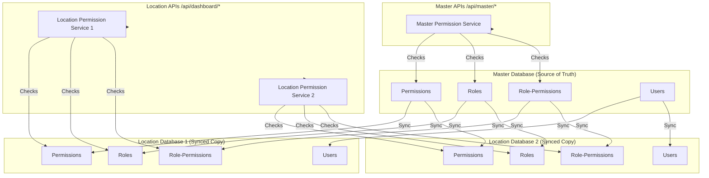

# Role-Based Permission System Implementation

## Overview

Implement a dynamic RBAC system that replaces hardcoded role checks with a flexible permission-based system. Users can manage roles, assign permissions, and control access at both module and action levels.

## Database Schema Changes

### 1. Create Permission Tables (Master Database)

Add to `prisma/master-schema.prisma`:

- **Permission Model**: Stores all available permissions
- `permissionId` (BigInt, PK)
- `permissionCode` (String, unique) - e.g., "users.create", "locations.view"
- `permissionName` (String) - Display name
- `module` (String) - Module name (e.g., "users", "locations", "reports")
- `action` (String) - Action type (e.g., "create", "read", "update", "delete", "manage")
- `description` (String, optional)
- `isActive` (Boolean)
- `syncId` (String, UUID) - For syncing to location databases
- `syncSource` (String) - "server" by default
- **RolePermission Model**: Junction table for role-permission mapping
- `rolePermissionId` (BigInt, PK)
- `roleCode` (String) - References role code
- `permissionCode` (String) - References permission code
- `createdOn` (DateTime)
- `syncId` (String, UUID) - For syncing to location databases
- **Role Model**: Extends existing role enum with management capabilities
- `roleId` (BigInt, PK)
- `roleCode` (String, unique) - Matches UserRole enum values
- `roleName` (String) - Display name
- `description` (String, optional)
- `isSystemRole` (Boolean) - True for built-in roles (SUPER_ADMIN, etc.)
- `isActive` (Boolean)
- `createdOn`, `updatedOn` (DateTime)
- `syncId` (String, UUID) - For syncing to location databases

### 1b. Create Permission Tables (Location Database)

Add to `prisma/schema.prisma`:

- **Permission Model**: Synced copy of master permissions
- Same structure as master, but read-only in location DB
- Used for local permission checks
- **RolePermission Model**: Synced role-permission mappings
- Same structure as master
- Used for local permission checks
- **Role Model**: Synced role definitions
- Same structure as master
- Used for local permission checks

**Note**: Location databases maintain a read-only copy of permissions for fast local checks. Master database is the source of truth.

### 2. Seed Default Permissions

Create migration/seed script to populate:

- All module permissions (users, locations, companies, dealers, menu, reports, etc.)
- All action permissions (create, read, update, delete, manage, view, etc.)
- Default roles with their permissions:
- SUPER_ADMIN: All permissions
- COMPANY_ADMIN: Company-scoped permissions
- DEALER_ADMIN: Dealer-scoped permissions
- OUTLET_MANAGER: Location-scoped permissions
- CAPTAIN, CASHIER, KITCHEN_STAFF: Limited permissions

## Permission Architecture: Master vs Location

### 3. Permission Architecture Diagram




### 4. Permission Check Strategy

**Master Database (Master APIs - `/api/master/*`):**

- All permission checks happen in **master database**
- Master is the source of truth for all permissions
- When roles/permissions change in master, they sync to locations

**Location Database (Location APIs - `/api/dashboard/*`):**

- Permission checks happen in **location database** (synced copy)
- Faster performance (no network call to master)
- Location DB maintains read-only copy of:
- Permission definitions
- Role definitions
- Role-permission mappings
- User-role assignments (via synced users)

### 5. Permission Sync Mechanism

**When to Sync Permissions:**

1. **Initial Sync**: When user is synced to location, also sync:

- User's role
- All permissions for that role
- Permission definitions (if not already synced)

2. **Permission Updates**: When permissions change in master:

- Create sync log entry for `tbl_permission`, `tbl_role`, or `tbl_role_permission`
- Sync processor updates location databases
- All locations get updated permission data

3. **Role Updates**: When role permissions are modified:

- Sync updated role-permission mappings to all locations
- Users with that role automatically get new permissions

**Sync Tables:**

- `tbl_permission` → `permissions` (location)
- `tbl_role` → `roles` (location)
- `tbl_role_permission` → `role_permissions` (location)

**Sync Flow:**

```javascript
Master DB (Source of Truth)
  ↓ User created/updated
  ↓ Permissions assigned to role
  ↓ Sync log created
  ↓ Sync processor
  ↓ Location DB (Synced Copy)
  ↓ Permission checks use local data
```


### 6. Permission Service Architecture

Create two permission service implementations:**Master Permission Service** (`src/lib/auth/permissionService.ts`):

- Checks permissions in master database
- Used by master API routes
- Methods:
- `hasPermission(userRole: string, permissionCode: string): Promise<boolean>`
- `getUserPermissions(userRole: string): Promise<string[]>`

**Location Permission Service** (`src/lib/auth/locationPermissionService.ts`):

- Checks permissions in location database
- Used by location/dashboard API routes
- Same interface as master service
- Uses local (synced) permission data for fast checks

## API Routes

### 3. Role Management APIs

Create `src/app/api/master/roles/route.ts`:

- `GET /api/master/roles` - List all roles with permission counts
- `POST /api/master/roles` - Create new role (only for non-system roles)

Create `src/app/api/master/roles/[code]/route.ts`:

- `GET /api/master/roles/[code]` - Get role details with permissions
- `PUT /api/master/roles/[code]` - Update role name/description
- `DELETE /api/master/roles/[code]` - Delete role (only non-system, non-assigned roles)

### 7. Permission Management APIs

Create `src/app/api/master/permissions/route.ts`:

- `GET /api/master/permissions` - List all permissions (grouped by module)
- `GET /api/master/permissions?module=users` - Filter by module

### 5. Role-Permission Assignment APIs

Create `src/app/api/master/roles/[code]/permissions/route.ts`:

- `GET /api/master/roles/[code]/permissions` - Get permissions for a role
- `PUT /api/master/roles/[code]/permissions` - Update role permissions (bulk assignment)
- Body: `{ permissions: ["users.create", "users.view", ...] }`

### 9. Update Sync Processor

Update `src/lib/sync/syncProcessor.ts`:

- Add permission sync handling:
- When `tbl_permission` changes → sync to location `permissions` table
- When `tbl_role` changes → sync to location `roles` table
- When `tbl_role_permission` changes → sync to location `role_permissions` table
- Add to `SYNC_TABLE_MAP`:
- `tbl_permission` → `permissions`
- `tbl_role` → `roles`
- `tbl_role_permission` → `role_permissions`

### 10. Update Access Control

Update `src/lib/auth/accessControl.ts`:

- Add permission-based checks for master routes
- Create helper: `checkMasterPermission(request, permissionCode)` - checks in master DB
- Create helper: `checkLocationPermission(userRole, permissionCode)` - checks in location DB
- Determine which service to use based on route context

## Frontend Components

### 8. Role Management Page

Create `src/app/master/roles/page.tsx`:

- List all roles in a table
- Show permission count per role
- Actions: View, Edit, Delete (for non-system roles)
- "Add Role" button

### 12. Role Form Modal

Create `src/components/master/RoleModal.tsx`:

- Form for creating/editing roles
- Fields: Role Code, Role Name, Description
- Validation: Role code must be unique, valid format

### 13. Permission Assignment Component

Create `src/components/master/PermissionAssignment.tsx`:

- Tree/checkbox interface for assigning permissions
- Group by module (Users, Locations, Companies, etc.)
- Actions within each module (Create, Read, Update, Delete, Manage)
- "Select All" per module
- Save button to update role permissions

### 11. Role Detail/Edit Page

Create `src/app/master/roles/[code]/page.tsx`:

- Display role information
- Permission assignment component
- List of users with this role
- Edit role details

### 15. Update User Creation Form

Update `src/app/master/users/page.tsx`:

- Fetch roles from API instead of hardcoded options
- Display role name with description
- Show permission summary for selected role (optional)

## Migration Strategy

### 16. Data Migration

Create migration script:

1. Create default permissions for all existing modules/actions
2. Create Role records for all existing UserRole enum values
3. Assign default permissions to system roles:

- SUPER_ADMIN: All permissions
- COMPANY_ADMIN: Company, Dealer, Location, User management (scoped)
- DEALER_ADMIN: Dealer, Location, User management (scoped)
- OUTLET_MANAGER: Location-scoped operations
- Others: Read-only or limited permissions

### 17. Update Existing API Routes

**Master API Routes** (`/api/master/*`):

- Use master permission service (checks in master DB)
- Update:
- `src/app/api/master/users/route.ts` - Use `checkMasterPermission()`
- `src/app/api/master/locations/route.ts` - Use `checkMasterPermission()`
- `src/app/api/master/companies/route.ts` - Use `checkMasterPermission()`
- All other master API routes

**Location API Routes** (`/api/dashboard/*`):

- Use location permission service (checks in location DB)
- Update:
- `src/app/api/dashboard/users/route.ts` - Use `checkLocationPermission()`
- `src/app/api/dashboard/menu/route.ts` - Use `checkLocationPermission()`
- All other dashboard API routes

Example replacements:

```typescript
// Master API - Old:
if (!['SUPER_ADMIN', 'COMPANY_ADMIN'].includes(admin.role))

// Master API - New:
if (!(await checkMasterPermission(request, 'companies.delete')))

// Location API - Old:
if (!['SUPER_ADMIN', 'OUTLET_MANAGER'].includes(session.user.role))

// Location API - New:
if (!(await checkLocationPermission(session.user.role, 'menu.create')))
```


## UI/UX Enhancements

### 18. Navigation Updates

Update `src/components/layouts/MasterDashboardLayout.tsx`:

- Add "Roles & Permissions" menu item (only for SUPER_ADMIN)
- Show/hide menu items based on user permissions

### 19. Permission Indicators

- Add permission badges/indicators in UI where applicable
- Show "No Permission" messages for restricted actions

## Testing & Validation

### 20. Permission Validation

- Test that SUPER_ADMIN has all permissions
- Test that COMPANY_ADMIN cannot access SUPER_ADMIN-only features
- Test that role permissions are enforced in all API routes
- Test permission caching performance

## Files to Create/Modify

**New Files:**

- `prisma/migrations/XXXXX_add_rbac_tables_master/migration.sql` - Master DB migration
- `prisma/migrations/XXXXX_add_rbac_tables_location/migration.sql` - Location DB migration
- `src/app/api/master/roles/route.ts`
- `src/app/api/master/roles/[code]/route.ts`
- `src/app/api/master/roles/[code]/permissions/route.ts`
- `src/app/api/master/permissions/route.ts`
- `src/lib/auth/permissionService.ts` - Master permission service
- `src/lib/auth/locationPermissionService.ts` - Location permission service
- `src/app/master/roles/page.tsx`
- `src/app/master/roles/[code]/page.tsx`
- `src/components/master/RoleModal.tsx`
- `src/components/master/PermissionAssignment.tsx`
- `scripts/seed-permissions.ts`

**Modified Files:**

- `prisma/master-schema.prisma` - Add Permission, Role, RolePermission models
- `prisma/schema.prisma` - Add Permission, Role, RolePermission models (synced copies)
- `src/lib/auth/accessControl.ts` - Add master and location permission checking
- `src/lib/sync/syncProcessor.ts` - Add permission sync handling
- `src/lib/sync/types.ts` - Add permission tables to sync mappings
- `src/app/master/users/page.tsx` - Fetch roles from API
- All master API route files - Replace role checks with `checkMasterPermission()`
- All dashboard API route files - Replace role checks with `checkLocationPermission()`
- `src/components/layouts/MasterDashboardLayout.tsx` - Add roles menu

## Implementation Order

1. **Database Schema (Master & Location)**

- Add Permission, Role, RolePermission models to master schema
- Add Permission, Role, RolePermission models to location schema
- Create migrations for both databases

2. **Seed Default Data**

- Seed permissions in master database
- Seed roles in master database
- Seed role-permission mappings in master database
- Initial sync of permissions to location databases

3. **Permission Services**

- Create master permission service (checks master DB)
- Create location permission service (checks location DB)
- Add caching for performance

4. **Sync Integration**

- Update sync processor to handle permission tables
- Add permission tables to sync mappings
- Test permission sync when roles/permissions change

5. **API Routes**

- Role management APIs (master)
- Permission management APIs (master)
- Role-permission assignment APIs (master)