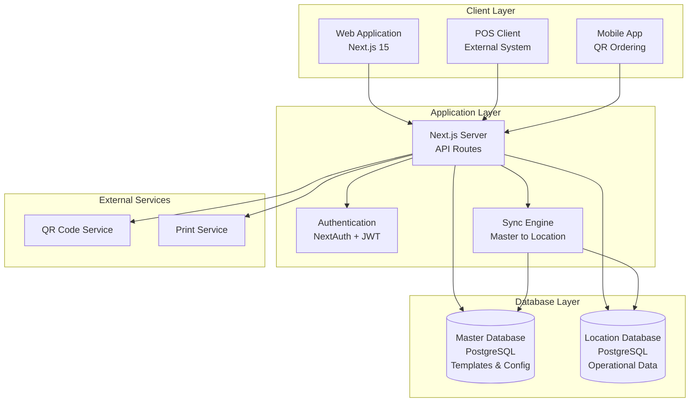
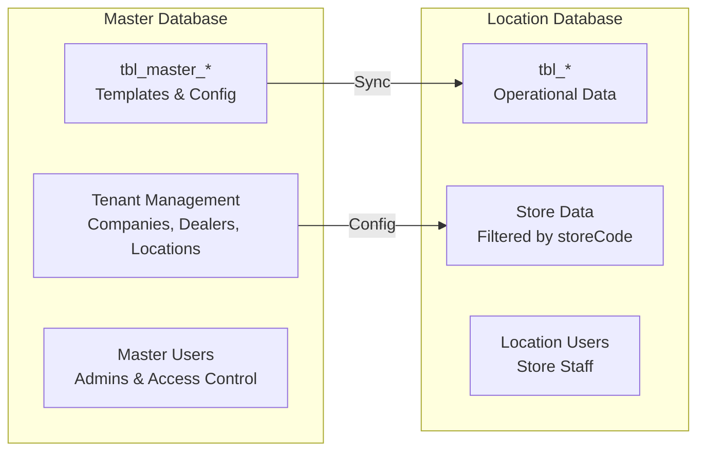
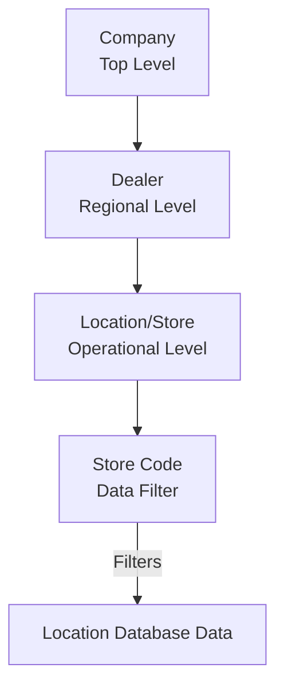
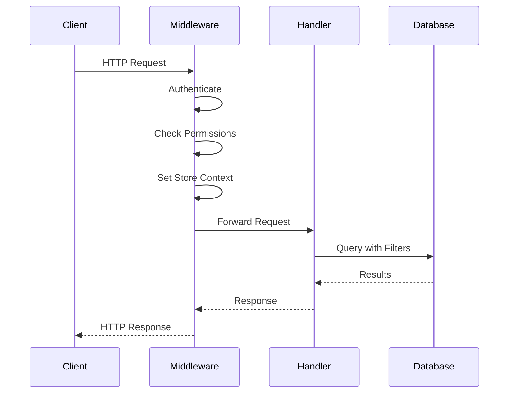
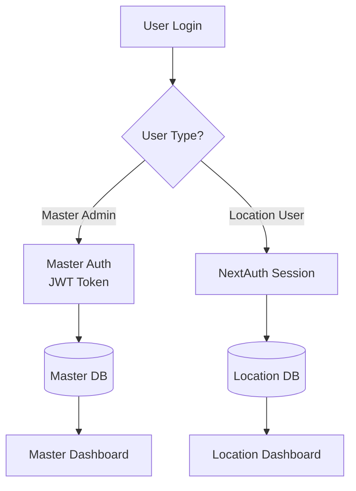
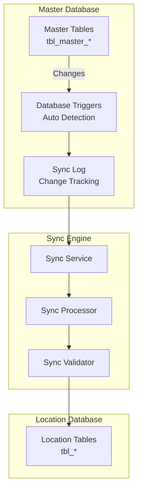
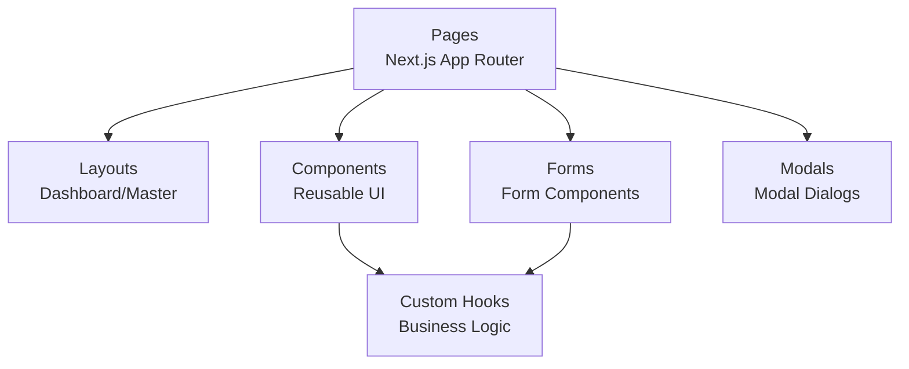
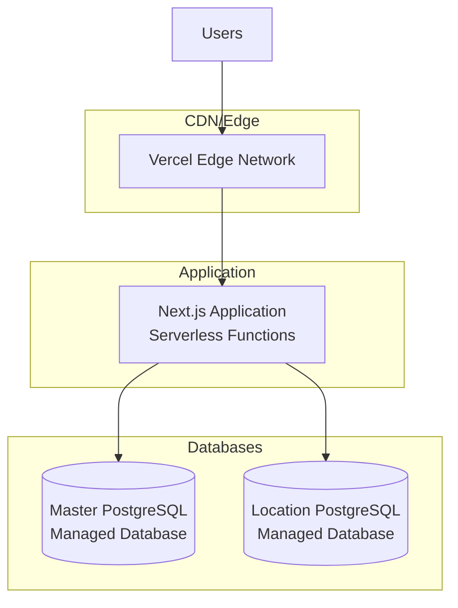

# System Architecture

> **📊 Viewing Diagrams**: This document contains Mermaid diagrams. To view them:
> - **VS Code/Cursor**: Install "Markdown Preview Mermaid Support" extension, then press `Ctrl+Shift+V` (Windows) or `Cmd+Shift+V` (Mac) to open preview
> - **GitHub**: Diagrams render automatically when viewing on GitHub
> - **Online**: Copy the mermaid code block and paste at [mermaid.live](https://mermaid.live)
> - **Alternative**: See text-based diagrams below each Mermaid diagram

## Table of Contents

1. [Overview](#overview)
2. [System Architecture](#system-architecture)
3. [Database Architecture](#database-architecture)
4. [Multi-Tenant Design](#multi-tenant-design)
5. [Technology Stack](#technology-stack)
6. [API Architecture](#api-architecture)
7. [Authentication & Authorization](#authentication--authorization)
8. [Sync System Architecture](#sync-system-architecture)
9. [Frontend Architecture](#frontend-architecture)
10. [Deployment Architecture](#deployment-architecture)

## Overview

The Restaurant POS System is a comprehensive multi-tenant Point of Sale solution designed for restaurant chains. It provides centralized management capabilities while supporting distributed operations across multiple locations.

### Key Characteristics

- **Multi-Tenant Architecture**: Supports multiple companies, dealers, and locations
- **Two-Database Design**: Separates master data templates from location-specific operational data
- **Real-Time Synchronization**: Automatic and manual sync between master and location databases
- **Role-Based Access Control**: Granular permissions system for different user roles
- **Scalable Design**: Built to handle multiple stores and high transaction volumes

## System Architecture

### High-Level Architecture Diagram



**Text-Based Visualization**:
```
┌─────────────────────────────────────────────────────────┐
│                    CLIENT LAYER                         │
├─────────────────────────────────────────────────────────┤
│  Web Application (Next.js 15)                           │
│  POS Client (External System)                          │
│  Mobile App (QR Ordering)                              │
└──────────────────┬─────────────────────────────────────┘
                    │
                    ▼
┌─────────────────────────────────────────────────────────┐
│                 APPLICATION LAYER                       │
├─────────────────────────────────────────────────────────┤
│  Next.js Server (API Routes)                           │
│    ├── Authentication (NextAuth + JWT)                 │
│    └── Sync Engine (Master to Location)                │
└──────────┬──────────────────────┬───────────────────────┘
           │                      │
           ▼                      ▼
┌──────────────────────┐  ┌──────────────────────┐
│   DATABASE LAYER     │  │  EXTERNAL SERVICES    │
├──────────────────────┤  ├──────────────────────┤
│ Master Database      │  │ QR Code Service      │
│ (PostgreSQL)         │  │ Print Service        │
│ - Templates & Config │  └──────────────────────┘
├──────────────────────┤
│ Location Database    │
│ (PostgreSQL)         │
│ - Operational Data   │
└──────────────────────┘
```

### Component Overview

1. **Web Application**: Next.js 15 application serving both frontend and API
2. **Master Database**: Stores templates, configurations, and tenant management data
3. **Location Database**: Stores operational data for all stores (filtered by storeCode)
4. **Sync Engine**: Handles synchronization between master and location databases
5. **Authentication Service**: Manages user authentication and authorization

## Database Architecture

### Two-Database Design

The system uses a two-database architecture to separate concerns:



**Text-Based Visualization**:
```
┌─────────────────────────────────────┐
│      MASTER DATABASE                │
├─────────────────────────────────────┤
│  tbl_master_*                        │
│  - Templates & Config                │
│                                      │
│  Tenant Management                   │
│  - Companies, Dealers, Locations     │
│                                      │
│  Master Users                        │
│  - Admins & Access Control          │
└──────────────┬───────────────────────┘
               │ Sync
               ▼
┌─────────────────────────────────────┐
│     LOCATION DATABASE               │
├─────────────────────────────────────┤
│  tbl_*                               │
│  - Operational Data                  │
│                                      │
│  Store Data                          │
│  - Filtered by storeCode            │
│                                      │
│  Location Users                      │
│  - Store Staff                       │
└─────────────────────────────────────┘
```

### Database Separation Strategy

#### Master Database (`MASTER_DATABASE_URL`)
- **Purpose**: Centralized template and configuration management
- **Contains**:
  - Company, Dealer, Location definitions
  - Master menu templates (MasterMenuItem, MasterMenuCategory, etc.)
  - Master time events
  - Master admin users
  - Sync configuration and logs
- **Access**: Master dashboard and sync engine

#### Location Database (`DATABASE_URL`)
- **Purpose**: Operational data for all stores
- **Contains**:
  - Store-specific menu items (filtered by `storeCode`)
  - Orders and transactions (filtered by `storeCode`)
  - Inventory (filtered by `storeCode`)
  - Tables and reservations (filtered by `storeCode`)
  - Location users and permissions
- **Access**: Location dashboard, POS clients, QR ordering

### Database Connection Management

```typescript
// Master Database Client
import { masterPrisma } from '@/lib/databaseManager'

// Location Database Client
import { prisma } from '@/lib/database'
```

## Multi-Tenant Design

### Tenant Hierarchy



**Text-Based Visualization**:
```
Company (Top Level)
    │
    ├── Dealer (Regional Level)
    │       │
    │       └── Location/Store (Operational Level)
    │               │
    │               └── Store Code (Data Filter)
    │                       │
    │                       └──> Filters Location Database Data
    │
    └── [More Dealers...]
```

### Store Code Filtering

All location database tables include a `storeCode` column that filters data:

```sql
-- Example: Get menu items for a specific store
SELECT * FROM tbl_menu_item 
WHERE store_code = 'STORE001' 
AND is_active = 1;
```

### Multi-Tenant Benefits

1. **Data Isolation**: Each store's data is logically separated
2. **Centralized Management**: Master templates ensure consistency
3. **Scalability**: Add new stores without schema changes
4. **Cost Efficiency**: Single location database for all stores

## Technology Stack

### Frontend

- **Framework**: Next.js 15.5.7 (App Router)
- **Language**: TypeScript 5.5.3
- **UI Library**: React 18.3.1
- **Styling**: Tailwind CSS 3.4.4
- **UI Components**: Headless UI 2.2.9
- **Icons**: Heroicons 2.1.4
- **Forms**: Formik 2.4.9 + Yup 1.7.1
- **State Management**: Zustand 4.5.4
- **Notifications**: React Hot Toast 2.4.1
- **Date Handling**: date-fns 3.6.0

### Backend

- **Runtime**: Node.js 18+
- **Framework**: Next.js API Routes
- **ORM**: Prisma 6.16.3
- **Database**: PostgreSQL (via pg 8.16.3)
- **Authentication**: NextAuth.js 4.24.7
- **JWT**: jsonwebtoken 9.0.2
- **Password Hashing**: bcryptjs 2.4.3
- **QR Codes**: qrcode 1.5.3
- **Real-time**: Socket.io 4.7.5 (optional)

### Development Tools

- **Type Checking**: TypeScript
- **Linting**: ESLint 8.57.0
- **API Documentation**: apidoc 1.2.0
- **Build Tool**: Next.js built-in
- **Package Manager**: npm

### Database

- **Primary**: PostgreSQL
- **ORM**: Prisma Client
- **Migrations**: Prisma Migrate
- **Connection Pooling**: Prisma built-in

## API Architecture

### API Structure

```mermaid
graph TB
    subgraph "API Routes"
        MasterAPI[/api/master/*<br/>Master Dashboard APIs]
        DashboardAPI[/api/dashboard/*<br/>Location Dashboard APIs]
        POSAPI[/api/pos/sync/*<br/>POS Sync APIs]
        AuthAPI[/api/auth/*<br/>Authentication APIs]
    end

    subgraph "Middleware"
        AuthMW[Authentication Middleware]
        PermissionMW[Permission Middleware]
        StoreMW[Store Context Middleware]
    end

    subgraph "Handlers"
        MasterHandler[Master Handlers<br/>Master DB Access]
        LocationHandler[Location Handlers<br/>Location DB Access]
        SyncHandler[Sync Handlers<br/>Both DBs]
    end

    MasterAPI --> AuthMW
    DashboardAPI --> AuthMW
    POSAPI --> AuthMW
    AuthMW --> PermissionMW
    PermissionMW --> StoreMW
    StoreMW --> MasterHandler
    StoreMW --> LocationHandler
    StoreMW --> SyncHandler
```

**Text-Based Visualization**:
```
API Routes
├── /api/master/*          (Master Dashboard APIs)
├── /api/dashboard/*       (Location Dashboard APIs)
├── /api/pos/sync/*        (POS Sync APIs)
└── /api/auth/*            (Authentication APIs)
    │
    ▼
Middleware Stack
├── Authentication Middleware
│   └── Permission Middleware
│       └── Store Context Middleware
│           │
│           ├──> Master Handlers (Master DB Access)
│           ├──> Location Handlers (Location DB Access)
│           └──> Sync Handlers (Both DBs)
```

### API Endpoint Categories

#### 1. Master Dashboard APIs (`/api/master/*`)
- **Purpose**: Manage master templates and tenant configuration
- **Authentication**: Master admin JWT tokens
- **Database**: Master database
- **Examples**:
  - `/api/master/menu-items` - Master menu item management
  - `/api/master/locations` - Location management
  - `/api/master/sync/manual` - Manual sync triggers

#### 2. Location Dashboard APIs (`/api/dashboard/*`)
- **Purpose**: Store-specific operational data
- **Authentication**: NextAuth session
- **Database**: Location database (filtered by storeCode)
- **Examples**:
  - `/api/dashboard/menu/items` - Store menu items
  - `/api/dashboard/orders` - Store orders
  - `/api/dashboard/tables` - Store tables

#### 3. POS Sync APIs (`/api/pos/sync/*`)
- **Purpose**: External POS client synchronization
- **Authentication**: API key (storeCode-based)
- **Database**: Location database
- **Examples**:
  - `/api/pos/sync/[storeCode]/menu-items` - Sync menu items
  - `/api/pos/sync/[storeCode]/orders` - Sync orders

### Request Flow



## Authentication & Authorization

### Authentication Flow



### Authorization Layers

1. **Authentication**: Verify user identity
2. **Role-Based Access**: Check user role (Admin, Manager, etc.)
3. **Permission-Based**: Check module-specific permissions
4. **Store Access**: Verify user has access to requested store
5. **Data Filtering**: Apply storeCode filter automatically

## Sync System Architecture

### Sync Flow



### Sync Mechanisms

1. **Automatic Sync**: Database triggers detect changes
2. **Manual Sync**: API-triggered synchronization
3. **Scheduled Sync**: Cron-based periodic sync
4. **Location-to-Location**: Cross-store data sharing

## Frontend Architecture

### Page Structure

```
src/app/
├── dashboard/          # Location dashboard pages
│   ├── menu/          # Menu management
│   ├── orders/        # Order management
│   ├── tables/        # Table management
│   └── ...
├── master/            # Master dashboard pages
│   ├── menu/          # Master menu management
│   ├── locations/     # Location management
│   ├── sync/          # Sync management
│   └── ...
└── qr-order/          # QR ordering (public)
```

### Component Architecture



### State Management

- **Server State**: React Server Components + API routes
- **Client State**: Zustand for global state
- **Form State**: Formik for form management
- **UI State**: React useState for component state

## Deployment Architecture

### Production Deployment



### Environment Configuration

- **Development**: Local PostgreSQL databases
- **Staging**: Managed PostgreSQL (development instances)
- **Production**: Managed PostgreSQL (production instances)
- **Environment Variables**: Vercel environment configuration

### Scaling Considerations

1. **Database**: Connection pooling, read replicas
2. **Application**: Serverless auto-scaling
3. **Caching**: Next.js built-in caching
4. **CDN**: Vercel Edge Network for static assets

## Key Architectural Decisions

### 1. Two-Database Architecture
- **Rationale**: Separates template management from operational data
- **Benefit**: Clear separation of concerns, easier maintenance
- **Trade-off**: Requires sync mechanism

### 2. Store Code Filtering
- **Rationale**: Single database for all stores reduces complexity
- **Benefit**: Cost-effective, easier to manage
- **Trade-off**: Requires careful query filtering

### 3. Prisma ORM
- **Rationale**: Type-safe database access, migrations
- **Benefit**: Developer experience, type safety
- **Trade-off**: Learning curve, migration management

### 4. Next.js App Router
- **Rationale**: Modern React patterns, server components
- **Benefit**: Performance, SEO, developer experience
- **Trade-off**: Migration from Pages Router

### 5. UUID-Based Sync
- **Rationale**: Reliable cross-database identification
- **Benefit**: No conflicts, traceable sync
- **Trade-off**: Additional storage, complexity

## Security Architecture

### Security Layers

1. **Network**: HTTPS/TLS encryption
2. **Authentication**: JWT tokens + NextAuth sessions
3. **Authorization**: Role-based + permission-based
4. **Data**: Store code filtering, SQL injection prevention
5. **API**: Rate limiting, input validation

### Security Best Practices

- Password hashing with bcrypt
- JWT token expiration
- CORS configuration
- Input sanitization
- SQL injection prevention (Prisma)
- XSS protection (React)

## Performance Considerations

### Optimization Strategies

1. **Database**: Indexes on frequently queried columns
2. **API**: Response caching where appropriate
3. **Frontend**: Code splitting, lazy loading
4. **Images**: Next.js Image optimization
5. **Queries**: Efficient Prisma queries

### Monitoring

- Database query performance
- API response times
- Error rates
- Sync operation success rates

## Related Documentation

- [Database Schema](./DATABASE_SCHEMA.md) - Detailed database documentation
- [API Reference](./API_REFERENCE.md) - Complete API documentation
- [Sync System](./SYNC_SYSTEM_COMPLETE.md) - Sync system details
- [Authentication](./AUTHENTICATION_AUTHORIZATION.md) - Auth system details
- [Deployment](./DEPLOYMENT.md) - Deployment guide
