# Database ER Diagrams and Relationship Documentation

Complete Entity-Relationship diagrams for Master and Location databases.

## Table of Contents

1. [Master Database ER Diagrams](#master-database-er-diagrams)
2. [Location Database ER Diagrams](#location-database-er-diagrams)
3. [Complete Relationship Diagrams](#complete-relationship-diagrams)
4. [Cross-Database Relationships](#cross-database-relationships)

---

## Master Database ER Diagrams

### Complete Master Database ERD

```mermaid
erDiagram
    Company ||--o{ Dealer : "has"
    Company ||--o{ Location : "has"
    Company ||--o{ User : "belongs_to"
    Dealer ||--o{ Location : "has"
    Dealer ||--o{ User : "belongs_to"
    Location ||--o{ User : "belongs_to"
    Location ||--o{ UserStoreAccess : "has"
    User ||--o{ UserStoreAccess : "has"
    
    MasterMenuMaster ||--o{ MasterMenuCategory : "has"
    MasterMenuMaster ||--o{ MasterMenuMasterEvent : "has"
    MasterMenuCategory ||--o{ MasterMenuItem : "has"
    MasterMenuCategory ||--o{ MasterMenuCategoryModifier : "has"
    MasterMenuItem ||--o{ MasterMenuItemModifierGroup : "has"
    MasterMenuItem ||--o{ MasterMenuItemTimeEvent : "has"
    MasterTimeEvent ||--o{ MasterMenuMasterEvent : "applies_to"
    MasterTimeEvent ||--o{ MasterMenuItemTimeEvent : "applies_to"
    MasterModifierGroup ||--o{ MasterModifierItem : "has"
    MasterModifierGroup ||--o{ MasterMenuCategoryModifier : "has"
    MasterModifierGroup ||--o{ MasterMenuItemModifierGroup : "has"
    
    Permission ||--o{ RolePermission : "has"
    Role ||--o{ RolePermission : "has"
    
    Location ||--o{ SyncLog : "tracks"
    Location ||--o{ SyncStatus : "tracks"
    
    Company {
        bigint company_id PK
        string company_code UK
        string company_name
        string address_line1
        string city
        string state
        string country
        string zipcode
        string phone
        string email
        int is_active
        datetime created_on
        datetime updated_on
    }
    
    Dealer {
        bigint dealer_id PK
        string dealer_code UK
        string dealer_name
        bigint company_id FK
        string address_line1
        string city
        string state
        string country
        string zipcode
        string phone
        string email
        int is_active
        datetime created_on
        datetime updated_on
    }
    
    Location {
        bigint location_id PK
        string location_code UK
        string location_name
        bigint company_id FK
        bigint dealer_id FK
        string store_code UK
        string api_key UK
        string address_line1
        string city
        string state
        string country
        string zipcode
        string phone
        string email
        string federal_tax_id
        string social_security_number
        json entity_type
        int is_active
        int sync_enabled
        datetime last_sync_at
        datetime created_on
        datetime updated_on
    }
    
    Admin {
        bigint admin_id PK
        string email UK
        string username UK
        string password
        string first_name
        string last_name
        enum role
        boolean is_active
        datetime last_login_at
        datetime created_on
        datetime updated_on
    }
    
    User {
        bigint user_id PK
        string email UK
        string username UK
        string password
        string first_name
        string last_name
        bigint company_id FK
        bigint dealer_id FK
        bigint location_id FK
        string role
        enum access_level
        string default_store_code
        boolean is_active
        uuid sync_id UK
        string sync_source
        datetime created_on
        datetime updated_on
    }
    
    UserStoreAccess {
        bigint id PK
        bigint user_id FK
        bigint location_id FK
        string store_code
        boolean is_default
        uuid sync_id UK
        string sync_source
        datetime created_on
    }
    
    MasterMenuMaster {
        bigint menu_master_id PK
        string menu_master_code UK
        string name
        string label_name
        string color_code
        json prep_zone_code
        json station_code
        int is_event_menu
        string dept_code
        string forcolor_code
        int is_active
        uuid sync_id UK
        string sync_source
        datetime createdon
        datetime updatedon
    }
    
    MasterMenuCategory {
        bigint menu_category_id PK
        string menu_master_code FK
        string menu_category_code UK
        string name
        string color_code
        string dept_code
        string forcolor_code
        int is_active
        uuid sync_id UK
        string sync_source
        datetime createdon
        datetime updatedon
    }
    
    MasterMenuItem {
        bigint menu_item_id PK
        string menu_item_code UK
        string menu_master_code FK
        json menu_category_code
        string name
        string kitchen_name
        string label_name
        string color_code
        string dept_code
        decimal base_price
        decimal card_price
        decimal cash_price
        int is_active
        uuid sync_id UK
        string sync_source
        datetime createdon
        datetime updatedon
    }
    
    MasterTimeEvent {
        bigint id PK
        string Event_code UK
        string EventName
        json dept_code
        decimal GlobalPrice_Amount_Add
        decimal GlobalPrice_Amount_Disc
        decimal GlobalPrice_Per_Add
        decimal GlobalPrice_Per_Disc
        boolean by_fixed_value
        boolean override_all_events
        boolean is_delete
        int is_active
        uuid sync_id UK
        string sync_source
        datetime created_date
        datetime updated_on
    }
    
    MasterMenuItemTimeEvent {
        bigint menuItemTimeEventId PK
        string menuItemTimeEventCode
        string menuItemCode FK
        string timeEventCode FK
        boolean isFixedValue
        boolean isDelete
        boolean isOverride
        decimal formulaValue
        boolean isActive
        uuid syncId UK
        string syncSource
        datetime createdOn
        datetime updatedOn
    }
    
    MasterModifierGroup {
        bigint id PK
        string modifier_group_code UK
        string group_name
        string label_name
        int is_required
        int is_multiselect
        int min_selection
        int max_selection
        decimal price
        json prefix
        int is_active
        uuid sync_id UK
        string sync_source
        datetime createdon
        datetime updatedon
    }
    
    MasterModifierItem {
        bigint id PK
        string modifier_item_code UK
        string modifier_group_code FK
        string name
        string label_name
        string color_code
        decimal price
        int is_default
        int display_order
        int is_active
        uuid sync_id UK
        string sync_source
        datetime createdon
        datetime updatedon
    }
    
    MasterMenuMasterEvent {
        bigint id PK
        string menu_master_code FK
        string event_code FK
        uuid sync_id UK
        string sync_source
        datetime createdon
    }
    
    MasterMenuCategoryModifier {
        bigint id PK
        string menu_category_code FK
        string modifier_group_code FK
        uuid sync_id UK
        string sync_source
        datetime createdon
    }
    
    MasterMenuItemModifierGroup {
        bigint id PK
        string menu_item_code FK
        string modifier_group_code FK
        int inherit_from_menu_group
        int is_inherit_from_menu_category
        int is_required
        int is_multiselect
        uuid sync_id UK
        string sync_source
        datetime createdon
    }
    
    Permission {
        bigint permission_id PK
        string permission_code UK
        string permission_name
        string module
        string action
        text description
        boolean is_active
        uuid sync_id UK
        string sync_source
        datetime created_on
        datetime updated_on
    }
    
    Role {
        bigint role_id PK
        string role_code UK
        string role_name
        text description
        boolean is_system_role
        boolean is_active
        uuid sync_id UK
        string sync_source
        datetime created_on
        datetime updated_on
    }
    
    RolePermission {
        bigint role_permission_id PK
        string role_code FK
        string permission_code FK
        uuid sync_id UK
        string sync_source
        datetime created_on
    }
    
    SyncLog {
        bigint id PK
        text table_name
        uuid record_id
        text operation
        text source
        jsonb data
        datetime change_time
        int sync_status
        string location_code
        text error_message
        int retry_count
        datetime last_retry_at
        datetime synced_at
        int synced_by
    }
    
    SyncStatus {
        bigint id PK
        string location_code
        text table_name
        datetime last_sync_time
        int last_sync_status
        bigint total_records_synced
        text last_error_message
        datetime created_at
        datetime updated_at
    }
```

### Tenant Management ERD

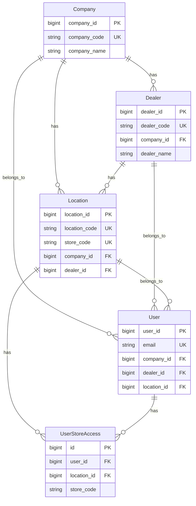

### Menu Hierarchy ERD

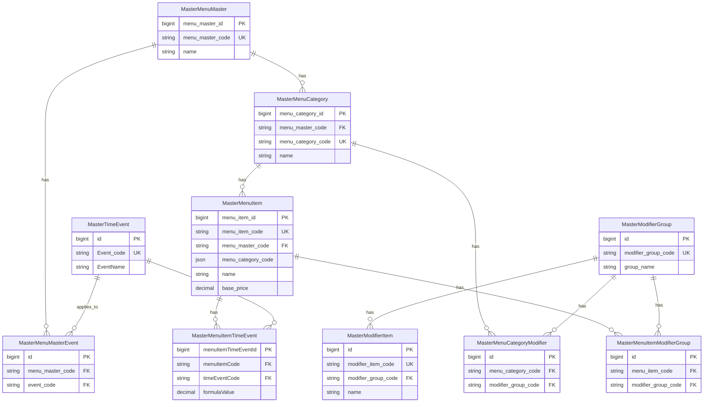

### Permission System ERD

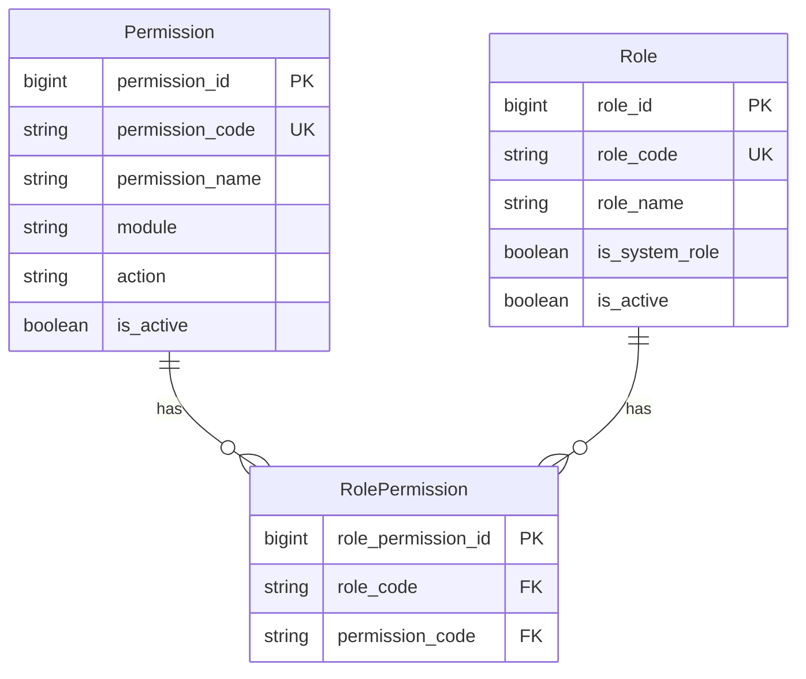

### Sync System ERD

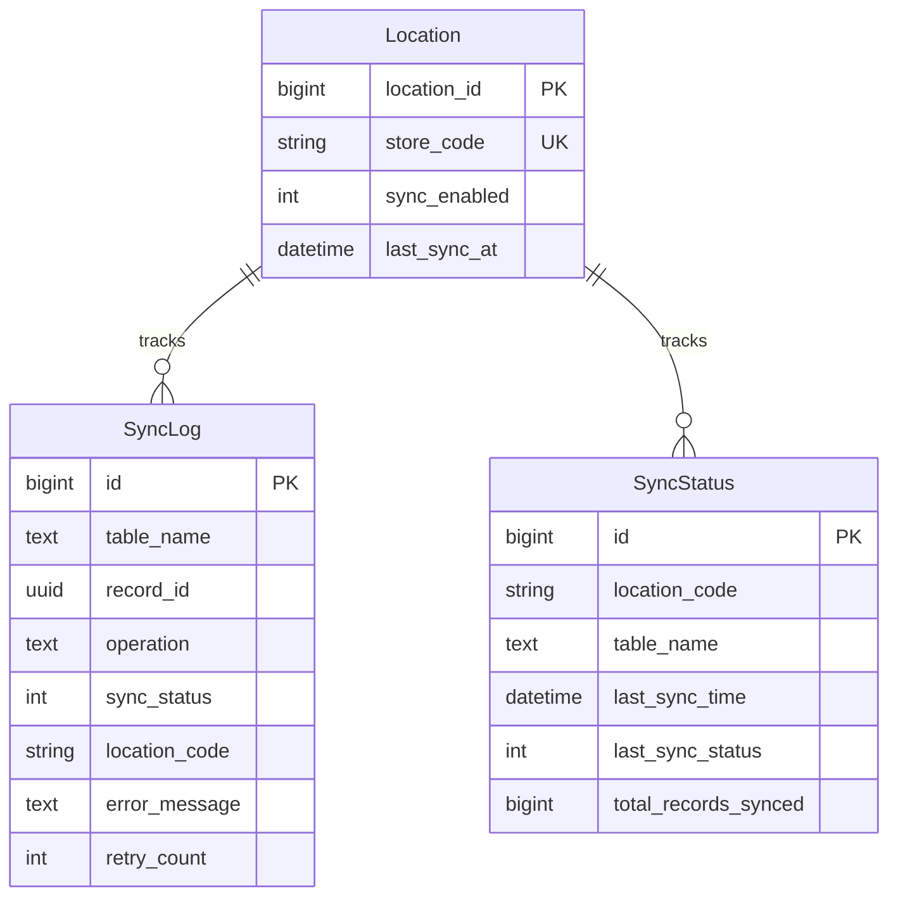

---

## Location Database ER Diagrams

### Complete Location Database ERD

```mermaid
erDiagram
    User ||--o{ UserLoginActivity : "has"
    User ||--o{ UserStoreAccess : "has"
    
    MenuMaster ||--o{ MenuCategory : "has"
    MenuMaster ||--o{ MenuMasterEvent : "has"
    MenuCategory ||--o{ MenuItem : "has"
    MenuCategory ||--o{ MenuCategoryModifier : "has"
    MenuItem ||--o{ MenuItemModifierGroup : "has"
    MenuItem ||--o{ MenuItemTimeEvent : "has"
    MenuItem ||--o{ MenuItemPrepTime : "has"
    MenuItem ||--o{ OrderItem : "references"
    TimeEvent ||--o{ MenuMasterEvent : "applies_to"
    TimeEvent ||--o{ MenuItemTimeEvent : "applies_to"
    ModifierGroup ||--o{ ModifierItem : "has"
    ModifierGroup ||--o{ MenuCategoryModifier : "has"
    ModifierGroup ||--o{ MenuItemModifierGroup : "has"
    
    Table ||--o{ Order : "has"
    Order ||--o{ OrderItem : "contains"
    
    Tax ||--o{ MenuItem : "applies_to"
    Department ||--o{ MenuItem : "has"
    DepartmentType ||--o{ Department : "has"
    Station ||--o{ PrepZone : "has"
    Printer ||--o{ PrepZone : "has"
    
    User {
        int id PK
        string email UK
        string username UK
        string password
        string firstName
        string lastName
        string role
        enum accessLevel
        bigint companyId FK
        bigint dealerId FK
        bigint locationId FK
        string defaultStoreCode
        boolean isActive
        uuid syncId UK
        string syncSource
        datetime createdAt
        datetime updatedAt
    }
    
    UserStoreAccess {
        bigint id PK
        int user_id FK
        string store_code
        boolean is_default
        uuid sync_id UK
        string sync_source
        datetime created_at
    }
    
    UserLoginActivity {
        bigint id PK
        int user_id FK
        string email
        string store_code
        datetime login_at
        string ip_address
        string user_agent
        int success
    }
    
    MenuMaster {
        bigint menu_master_id PK
        string menu_master_code UK
        string name
        string label_name
        json prep_zone_code
        json station_code
        int is_event_menu
        string dept_code
        int is_active
        string store_code
        uuid sync_id UK
        string sync_source
        datetime createdon
        datetime updatedon
    }
    
    MenuCategory {
        bigint menu_category_id PK
        string menu_master_code FK
        string menu_category_code UK
        string name
        string color_code
        string dept_code
        int is_active
        string store_code
        uuid sync_id UK
        string sync_source
        datetime createdon
        datetime updatedon
    }
    
    MenuItem {
        bigint menu_item_id PK
        string menu_item_code
        string menu_master_code FK
        json menu_category_code
        string name
        string kitchen_name
        string dept_code
        decimal base_price
        decimal card_price
        decimal cash_price
        int is_active
        string tax_code
        string store_code
        uuid sync_id UK
        string sync_source
        datetime createdon
        datetime updatedon
    }
    
    TimeEvent {
        bigint id PK
        string Event_code UK
        string EventName
        json dept_code
        decimal GlobalPrice_Amount_Add
        decimal GlobalPrice_Amount_Disc
        boolean by_fixed_value
        boolean override_all_events
        boolean is_delete
        int is_active
        string store_code
        uuid sync_id UK
        string sync_source
        datetime created_date
        datetime updated_on
    }
    
    MenuItemTimeEvent {
        bigint menuItemTimeEventId PK
        string menuItemTimeEventCode
        string menuItemCode FK
        string timeEventCode FK
        boolean isFixedValue
        boolean isDelete
        boolean isOverride
        decimal formulaValue
        boolean isActive
        string store_code
        uuid syncId UK
        string syncSource
        datetime createdOn
        datetime updatedOn
    }
    
    ModifierGroup {
        bigint id PK
        string modifier_group_code
        string group_name
        int is_required
        int is_multiselect
        decimal price
        json prefix
        int is_active
        string store_code
        uuid sync_id UK
        string sync_source
        datetime createdon
        datetime updatedon
    }
    
    ModifierItem {
        bigint id PK
        string modifier_item_code
        string modifier_group_code FK
        string name
        decimal price
        int is_default
        int display_order
        int is_active
        string store_code
        uuid sync_id UK
        string sync_source
        datetime createdon
    }
    
    MenuMasterEvent {
        bigint id PK
        string menu_master_code FK
        string event_code FK
        string store_code
        uuid sync_id UK
        string sync_source
        datetime createdon
    }
    
    MenuCategoryModifier {
        bigint id PK
        string menu_category_code FK
        string modifier_group_code FK
        string store_code
        uuid sync_id UK
        string sync_source
        datetime createdon
    }
    
    MenuItemModifierGroup {
        bigint id PK
        string menu_item_code FK
        string modifier_group_code FK
        int inherit_from_menu_group
        int is_inherit_from_menu_category
        int is_required
        int is_multiselect
        string store_code
        uuid sync_id UK
        string sync_source
        datetime createdon
    }
    
    Table {
        int table_id PK
        string table_number UK
        int seating_capacity
        int current_occupancy
        string location
        int status
        string store_code
        datetime created_date
    }
    
    Order {
        bigint order_id PK
        string order_number UK
        int table_id FK
        string order_type
        string status
        string customer_name
        string customer_phone
        decimal subtotal
        decimal tax
        decimal discount
        decimal total
        text notes
        int created_by
        string store_code
        datetime created_at
        datetime updated_at
        datetime completed_at
    }
    
    OrderItem {
        bigint order_item_id PK
        bigint order_id FK
        bigint menu_item_id
        string menu_item_code
        string name
        int quantity
        decimal price
        decimal subtotal
        text notes
        string status
        string store_code
        datetime created_at
    }
    
    Tax {
        int tbl_tax_id PK
        string tax_code UK
        string taxname
        decimal taxrate
        string store_code
        uuid sync_id UK
        string sync_source
        datetime created_date
        datetime updated_on
    }
    
    Department {
        bigint dept_id PK
        string dept_code UK
        string dept_name
        string dept_taxcode
        string dept_type_code FK
        int is_active
        string store_code
        uuid sync_id UK
        string sync_source
        datetime createdon
        datetime updatedon
    }
    
    DepartmentType {
        bigint dept_type_id PK
        string dept_type_code UK
        string name
        int is_active
        string store_code
        uuid sync_id UK
        string sync_source
        datetime createdon
        datetime updatedon
    }
    
    Station {
        bigint tbl_station_id PK
        string station_code UK
        string stationname
        int is_active
        json station_groups
        boolean is_kitchen
        boolean is_bar
        boolean is_bill
        boolean is_report
        string store_code
        uuid sync_id UK
        string sync_source
        datetime createdon
        datetime updatedon
    }
    
    PrepZone {
        bigint prep_zone_id PK
        string prep_zone_code UK
        string prep_zone_name
        string station_code FK
        int is_active
        string printer_code FK
        string backup_printer_code
        string store_code
        uuid sync_id UK
        string sync_source
        datetime createdon
        datetime updatedon
    }
    
    Printer {
        bigint printer_id PK
        string printer_code UK
        string printer_name
        int is_active
        boolean isreceipt
        boolean isdocument
        boolean isKitchen
        string store_code
        uuid sync_id UK
        string sync_source
        datetime createdon
        datetime updatedon
    }
    
    MenuItemPrepTime {
        bigint id PK
        string menu_item_code FK
        json prep_zone_code
        string dimension
        string weight
        int prep_time_minutes
        string store_code
        datetime createdon
        datetime updatedon
    }
```

### Menu Hierarchy ERD (Location)

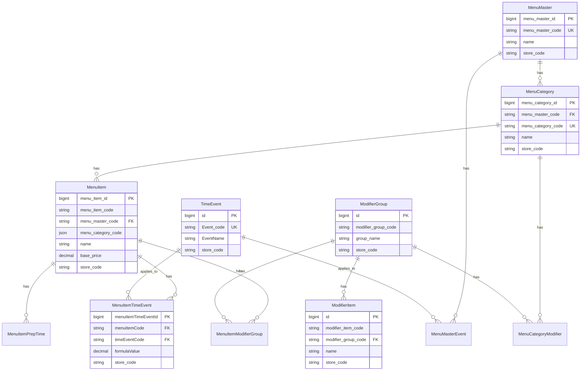

### Order Management ERD

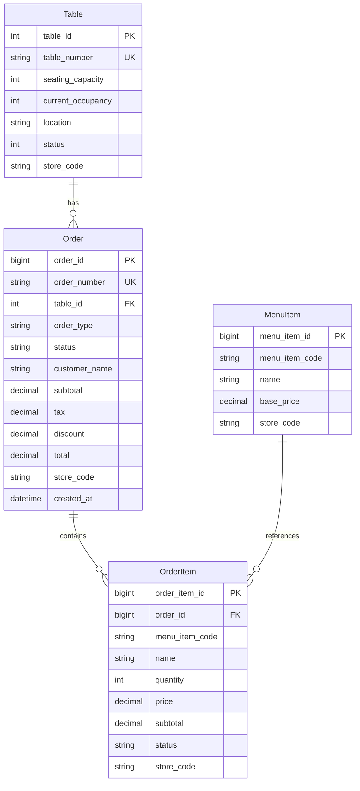

---

## Complete Relationship Diagrams

### Master to Location Sync Relationships

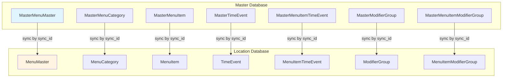

### Complete Table Dependency Graph

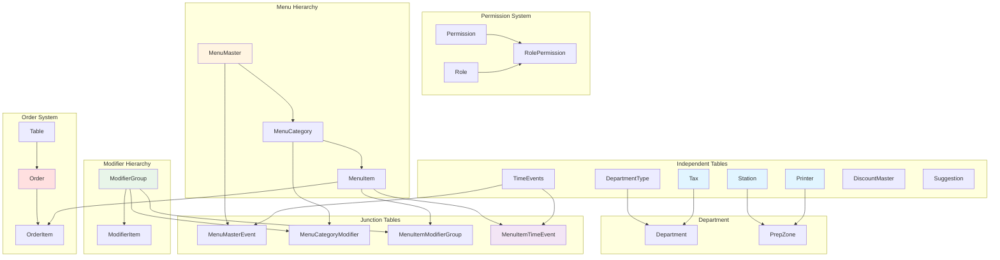

---

## Cross-Database Relationships

### Master-Location Sync Flow

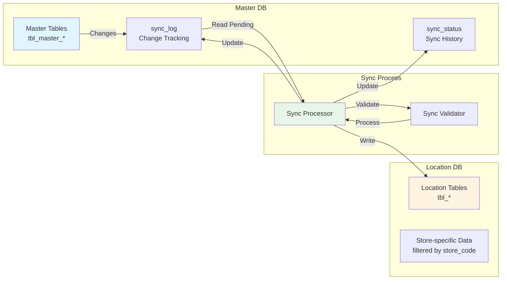

### Sync ID Relationship Pattern

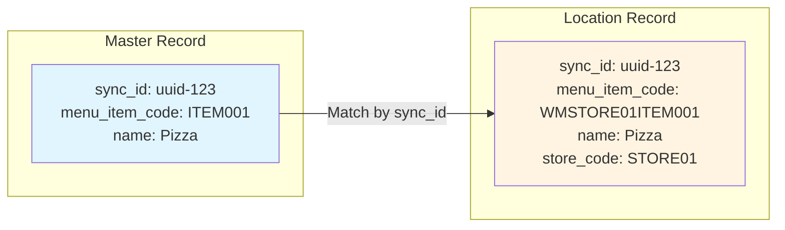

---

## Relationship Summary Tables

### Master Database Relationships

| Parent Table | Child Table | Relationship Type | Foreign Key |
|-------------|------------|-------------------|-------------|
| Company | Dealer | One-to-Many | dealer.company_id → company.company_id |
| Company | Location | One-to-Many | location.company_id → company.company_id |
| Company | User | One-to-Many | user.company_id → company.company_id |
| Dealer | Location | One-to-Many | location.dealer_id → dealer.dealer_id |
| Dealer | User | One-to-Many | user.dealer_id → dealer.dealer_id |
| Location | User | One-to-Many | user.location_id → location.location_id |
| Location | UserStoreAccess | One-to-Many | user_store_access.location_id → location.location_id |
| User | UserStoreAccess | One-to-Many | user_store_access.user_id → user.user_id |
| MasterMenuMaster | MasterMenuCategory | One-to-Many | menu_category.menu_master_code → menu_master.menu_master_code |
| MasterMenuMaster | MasterMenuMasterEvent | One-to-Many | menu_master_event.menu_master_code → menu_master.menu_master_code |
| MasterMenuCategory | MasterMenuItem | One-to-Many | menu_item.menu_category_code → menu_category.menu_category_code |
| MasterMenuCategory | MasterMenuCategoryModifier | One-to-Many | menu_category_modifier.menu_category_code → menu_category.menu_category_code |
| MasterMenuItem | MasterMenuItemModifierGroup | One-to-Many | menu_item_modifier_group.menu_item_code → menu_item.menu_item_code |
| MasterMenuItem | MasterMenuItemTimeEvent | One-to-Many | menuitem_timeevent.menu_item_code → menu_item.menu_item_code |
| MasterTimeEvent | MasterMenuMasterEvent | One-to-Many | menu_master_event.event_code → time_events.Event_code |
| MasterTimeEvent | MasterMenuItemTimeEvent | One-to-Many | menuitem_timeevent.time_event_code → time_events.Event_code |
| MasterModifierGroup | MasterModifierItem | One-to-Many | modifier_item.modifier_group_code → modifier_group.modifier_group_code |
| MasterModifierGroup | MasterMenuCategoryModifier | One-to-Many | menu_category_modifier.modifier_group_code → modifier_group.modifier_group_code |
| MasterModifierGroup | MasterMenuItemModifierGroup | One-to-Many | menu_item_modifier_group.modifier_group_code → modifier_group.modifier_group_code |
| Permission | RolePermission | One-to-Many | role_permission.permission_code → permission.permission_code |
| Role | RolePermission | One-to-Many | role_permission.role_code → role.role_code |

### Location Database Relationships

| Parent Table | Child Table | Relationship Type | Foreign Key |
|-------------|------------|-------------------|-------------|
| User | UserLoginActivity | One-to-Many | user_login_activity.user_id → user.id |
| User | UserStoreAccess | One-to-Many | user_store_access.user_id → user.id |
| MenuMaster | MenuCategory | One-to-Many | menu_category.menu_master_code → menu_master.menu_master_code |
| MenuMaster | MenuMasterEvent | One-to-Many | menu_master_event.menu_master_code → menu_master.menu_master_code |
| MenuCategory | MenuItem | One-to-Many | menu_item.menu_category_code → menu_category.menu_category_code |
| MenuCategory | MenuCategoryModifier | One-to-Many | menu_category_modifier.menu_category_code → menu_category.menu_category_code |
| MenuItem | MenuItemModifierGroup | One-to-Many | menu_item_modifier_group.menu_item_code → menu_item.menu_item_code |
| MenuItem | MenuItemTimeEvent | One-to-Many | menuitem_timeevent.menu_item_code → menu_item.menu_item_code |
| MenuItem | MenuItemPrepTime | One-to-Many | menu_item_prep_time.menu_item_code → menu_item.menu_item_code |
| TimeEvent | MenuMasterEvent | One-to-Many | menu_master_event.event_code → time_events.Event_code |
| TimeEvent | MenuItemTimeEvent | One-to-Many | menuitem_timeevent.time_event_code → time_events.Event_code |
| ModifierGroup | ModifierItem | One-to-Many | modifier_item.modifier_group_code → modifier_group.modifier_group_code |
| ModifierGroup | MenuCategoryModifier | One-to-Many | menu_category_modifier.modifier_group_code → modifier_group.modifier_group_code |
| ModifierGroup | MenuItemModifierGroup | One-to-Many | menu_item_modifier_group.modifier_group_code → modifier_group.modifier_group_code |
| Table | Order | One-to-Many | order.table_id → table.table_id |
| Order | OrderItem | One-to-Many | order_item.order_id → order.order_id (CASCADE DELETE) |
| MenuItem | OrderItem | Many-to-One | order_item.menu_item_code → menu_item.menu_item_code |
| DepartmentType | Department | One-to-Many | department.dept_type_code → department_type.dept_type_code |
| Station | PrepZone | One-to-Many | prep_zone.station_code → station.station_code |
| Printer | PrepZone | One-to-Many | prep_zone.printer_code → printer.printer_code |

---

## Related Documentation

- [Database Comprehensive Documentation](./DATABASE_COMPREHENSIVE_DOCUMENTATION.md) - Complete table specifications
- [Database Schema](./DATABASE_SCHEMA.md) - Schema overview
- [Sync System Documentation](./SYNC_SYSTEM_COMPREHENSIVE_DOCUMENTATION.md) - Sync system details
