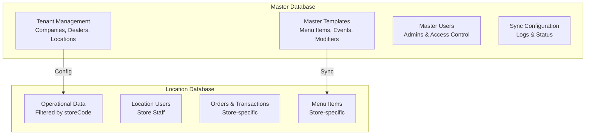
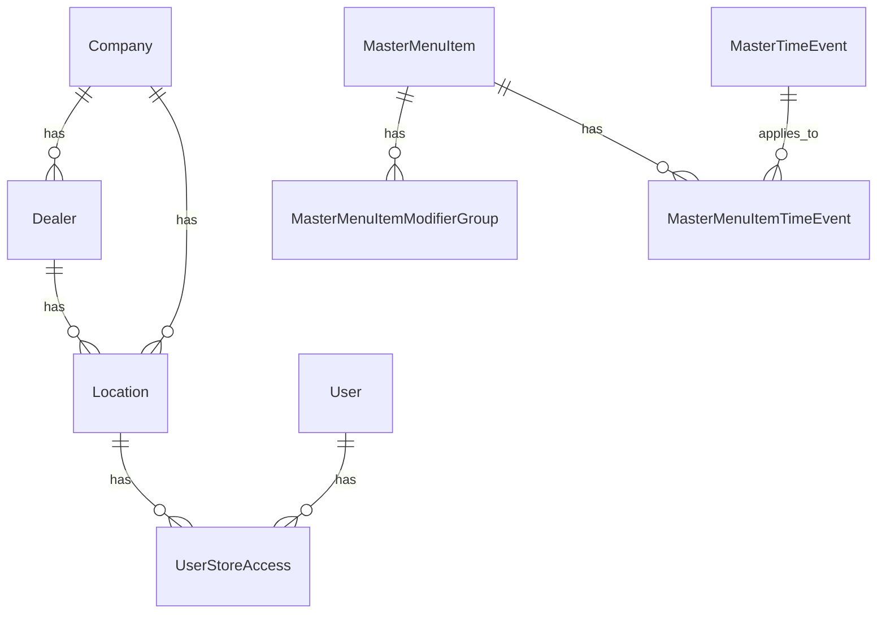
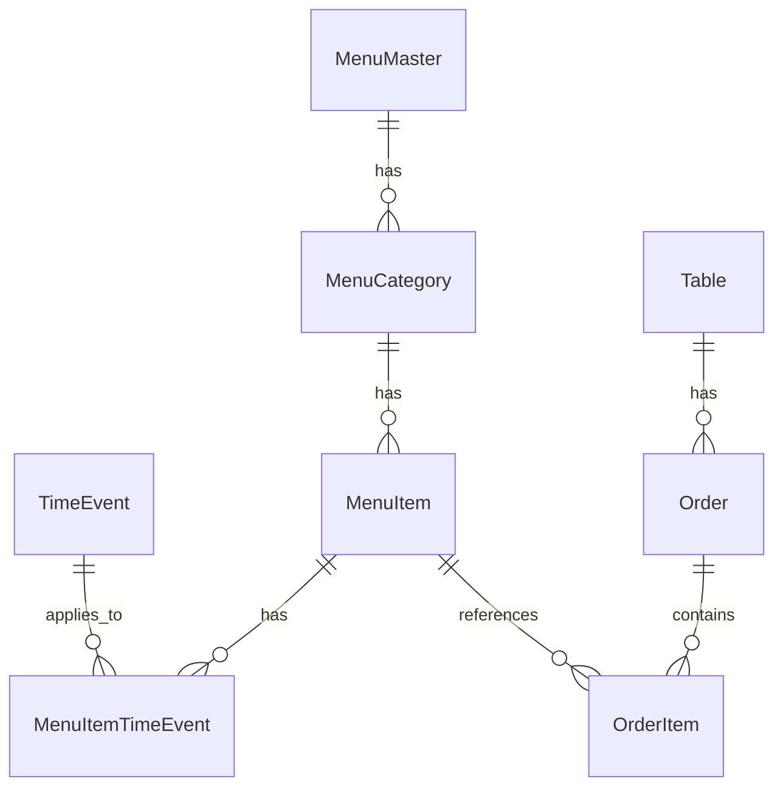

# Database Schema Documentation

## Table of Contents

1. [Overview](#overview)
2. [Database Architecture](#database-architecture)
3. [Master Database Schema](#master-database-schema)
4. [Location Database Schema](#location-database-schema)
5. [Entity Relationships](#entity-relationships)
6. [Indexes and Performance](#indexes-and-performance)
7. [Database Functions](#database-functions)
8. [Stored Procedures](#stored-procedures)
9. [Database Triggers](#database-triggers)
10. [Sync System Tables](#sync-system-tables)
11. [Migration Strategy](#migration-strategy)

## Overview

The Restaurant POS System uses a **two-database architecture**:

1. **Master Database**: Stores templates, configurations, and tenant management
2. **Location Database**: Stores operational data for all stores (filtered by `storeCode`)

Both databases use **PostgreSQL** with **Prisma ORM** for type-safe database access.

## Database Architecture

### Database Separation



### Connection Strings

- **Master Database**: `MASTER_DATABASE_URL` environment variable
- **Location Database**: `DATABASE_URL` environment variable

### Multi-Tenant Design

All location database tables include a `storeCode` column for data isolation:

```sql
-- Example: All location tables have storeCode
SELECT * FROM tbl_menu_item WHERE store_code = 'STORE001';
```

## Master Database Schema

### Tenant Management Tables

#### tbl_company
Stores company information (top-level tenant).

| Column | Type | Description |
|--------|------|-------------|
| company_id | BigInt | Primary key |
| company_code | String(100) | Unique company identifier |
| company_name | String(500) | Company name |
| address_line1 | String(500) | Address line 1 |
| address_line2 | String(500) | Address line 2 |
| city | String(100) | City |
| state | String(100) | State |
| country | String(100) | Country |
| zipcode | String(20) | ZIP code |
| phone | String(50) | Phone number |
| email | String(255) | Email address |
| is_active | Int | Active status (1=active) |
| created_on | DateTime | Creation timestamp |
| updated_on | DateTime | Last update timestamp |

**Indexes**: `company_code` (unique)

#### tbl_dealer
Stores dealer information (regional level).

| Column | Type | Description |
|--------|------|-------------|
| dealer_id | BigInt | Primary key |
| dealer_code | String(100) | Unique dealer identifier |
| dealer_name | String(500) | Dealer name |
| company_id | BigInt | Foreign key to tbl_company |
| address_line1 | String(500) | Address line 1 |
| address_line2 | String(500) | Address line 2 |
| city | String(100) | City |
| state | String(100) | State |
| country | String(100) | Country |
| zipcode | String(20) | ZIP code |
| phone | String(50) | Phone number |
| email | String(255) | Email address |
| is_active | Int | Active status (1=active) |
| created_on | DateTime | Creation timestamp |
| updated_on | DateTime | Last update timestamp |

**Indexes**: `dealer_code` (unique), `company_id`

#### tbl_location
Stores location/store information (operational level).

| Column | Type | Description |
|--------|------|-------------|
| location_id | BigInt | Primary key |
| location_name | String(500) | Location name |
| company_id | BigInt | Foreign key to tbl_company |
| dealer_id | BigInt | Foreign key to tbl_dealer |
| store_code | String(100) | Unique store code (used for filtering in location DB) |
| api_key | String(255) | API key for POS client authentication |
| address_line1 | String(500) | Address line 1 |
| address_line2 | String(500) | Address line 2 |
| city | String(100) | City |
| state | String(100) | State |
| country | String(100) | Country |
| zipcode | String(20) | ZIP code |
| phone | String(50) | Phone number |
| email | String(255) | Email address |
| federal_tax_id | String(20) | Federal tax ID |
| social_security_number | String(15) | SSN |
| entity_type | Json | Entity type information |
| is_active | Int | Active status (1=active) |
| sync_enabled | Int | Sync enabled (1=enabled) |
| last_sync_at | DateTime | Last sync timestamp |
| created_on | DateTime | Creation timestamp |
| updated_on | DateTime | Last update timestamp |

**Indexes**: `store_code` (unique), `api_key` (unique), `company_id`, `dealer_id`

### Master User Tables

#### tbl_admin
Stores master admin users for master dashboard.

| Column | Type | Description |
|--------|------|-------------|
| admin_id | BigInt | Primary key |
| email | String(255) | Unique email address |
| username | String(100) | Unique username |
| password | String | Hashed password |
| first_name | String(100) | First name |
| last_name | String(100) | Last name |
| role | AdminRole | Admin role (SUPER_ADMIN, COMPANY_ADMIN, DEALER_ADMIN) |
| is_active | Boolean | Active status |
| last_login_at | DateTime | Last login timestamp |
| created_on | DateTime | Creation timestamp |
| updated_on | DateTime | Last update timestamp |

**Indexes**: `email` (unique), `username` (unique)

#### tbl_user
Stores users with access to locations.

| Column | Type | Description |
|--------|------|-------------|
| user_id | BigInt | Primary key |
| email | String(255) | Unique email address |
| username | String(100) | Unique username |
| password | String | Hashed password |
| first_name | String(100) | First name |
| last_name | String(100) | Last name |
| company_id | BigInt | Foreign key to tbl_company |
| dealer_id | BigInt | Foreign key to tbl_dealer |
| location_id | BigInt | Foreign key to tbl_location |
| role | String(100) | User role |
| access_level | AccessLevel | Access level (SUPER_ADMIN, COMPANY, DEALER, LOCATION) |
| default_store_code | String(100) | Default store code |
| is_active | Boolean | Active status |
| sync_id | UUID | Sync identifier |
| sync_source | String(20) | Sync source |
| created_on | DateTime | Creation timestamp |
| updated_on | DateTime | Last update timestamp |

**Indexes**: `email` (unique), `username` (unique), `company_id`, `dealer_id`, `location_id`, `sync_id`

#### tbl_user_store_access
Maps users to store access.

| Column | Type | Description |
|--------|------|-------------|
| id | BigInt | Primary key |
| user_id | BigInt | Foreign key to tbl_user |
| location_id | BigInt | Foreign key to tbl_location |
| store_code | String(100) | Store code |
| is_default | Boolean | Is default store |
| created_on | DateTime | Creation timestamp |
| sync_id | UUID | Sync identifier |
| sync_source | String(20) | Sync source |

**Indexes**: `user_id`, `store_code`, `location_id`, `sync_id`
**Unique Constraint**: `(user_id, store_code)`

### Master Template Tables

#### tbl_master_menu_item
Master menu item templates.

| Column | Type | Description |
|--------|------|-------------|
| menu_item_id | BigInt | Primary key |
| menu_item_code | String(100) | Unique menu item code |
| menu_master_code | String(100) | Menu master code |
| menu_category_code | Json | Category codes (array) |
| name | String(500) | Item name |
| kitchen_name | String(150) | Kitchen display name |
| label_name | String(500) | Label name |
| color_code | String(100) | Color code |
| dept_code | String(100) | Department code |
| forcolor_code | String(100) | For color code |
| calories | String(100) | Calories |
| description | Text | Description |
| item_size | String(50) | Item size |
| sku_plu | BigInt | SKU/PLU |
| barcode | String(100) | Barcode |
| is_alcohol | Int | Is alcohol (0=no, 1=yes) |
| menu_img | String | Image URL |
| price_strategy | Int | Price strategy (1=Base Price, 3=Open Price) |
| base_price | Decimal(10,2) | Base price |
| card_price | Decimal(10,2) | Card price |
| cash_price | Decimal(10,2) | Cash price |
| is_price | Int | Is priced (1=yes) |
| is_active | Int | Active status (1=active) |
| stockinhand | Decimal(18,2) | Stock in hand |
| tax_code | String(50) | Tax code |
| sync_id | UUID | Sync identifier |
| sync_source | String(20) | Sync source |
| createdon | DateTime | Creation timestamp |
| updatedon | DateTime | Last update timestamp |

**Indexes**: `menu_item_code` (unique), `sync_id`

#### tbl_master_time_events
Master time event templates.

| Column | Type | Description |
|--------|------|-------------|
| id | BigInt | Primary key |
| Event_code | String(100) | Unique event code |
| EventName | String(100) | Event name |
| dept_code | Json | Department codes (array) |
| GlobalPrice_Amount_Add | Decimal(18,2) | Amount to add |
| GlobalPrice_Amount_Disc | Decimal(18,2) | Amount discount |
| GlobalPrice_Per_Add | Decimal(18,2) | Percentage add |
| GlobalPrice_Per_Disc | Decimal(18,2) | Percentage discount |
| Monday through Sunday | String(50) | Day names |
| Mon_StartTime through Sun_StartTime | String(10) | Start times |
| Mon_EndTime through Sun_EndTime | String(10) | End times |
| Event_Start_Date | Date | Event start date |
| Event_End_Date | Date | Event end date |
| by_fixed_value | Boolean | Fixed value mode |
| override_all_events | Boolean | Override all events |
| is_delete | Boolean | Deleted flag |
| is_active | Int | Active status (1=active) |
| sync_id | UUID | Sync identifier |
| sync_source | String(20) | Sync source |
| created_date | DateTime | Creation timestamp |
| updated_on | DateTime | Last update timestamp |

**Indexes**: `Event_code` (unique), `sync_id`

### Sync System Tables

#### sync_log
Tracks changes for synchronization.

| Column | Type | Description |
|--------|------|-------------|
| id | BigInt | Primary key |
| table_name | Text | Table name |
| record_id | UUID | Record identifier |
| operation | Text | Operation (INSERT/UPDATE/DELETE) |
| source | Text | Source (server/terminal/website) |
| data | JsonB | Full row data |
| change_time | DateTime | Change timestamp |
| sync_status | Int | Sync status (0=pending, 1=processed, 2=failed) |
| location_code | String(100) | Location code |
| error_message | Text | Error message |
| retry_count | Int | Retry count |
| last_retry_at | DateTime | Last retry timestamp |
| synced_at | DateTime | Sync completion timestamp |
| synced_by | Int | User who synced |

**Indexes**: `(sync_status, change_time)`, `(table_name, record_id)`, `location_code`, `(sync_status, location_code, table_name)`

#### sync_status
Tracks sync status per location/table.

| Column | Type | Description |
|--------|------|-------------|
| id | BigInt | Primary key |
| location_code | String(100) | Location code |
| table_name | Text | Table name |
| last_sync_time | DateTime | Last sync timestamp |
| last_sync_status | Int | Last sync status (0=success, 1=failed) |
| total_records_synced | BigInt | Total records synced |
| last_error_message | Text | Last error message |
| created_at | DateTime | Creation timestamp |
| updated_at | DateTime | Last update timestamp |

**Indexes**: `location_code`, `table_name`
**Unique Constraint**: `(location_code, table_name)`

## Location Database Schema

### User Tables

#### users
Location users (synced from master).

| Column | Type | Description |
|--------|------|-------------|
| id | Int | Primary key |
| email | String | Unique email |
| username | String | Unique username |
| password | String | Hashed password |
| firstName | String | First name |
| lastName | String | Last name |
| phone | String | Phone number |
| role | String(100) | User role |
| access_level | AccessLevel | Access level |
| company_id | BigInt | Company ID |
| dealer_id | BigInt | Dealer ID |
| location_id | BigInt | Location ID |
| default_store_code | String(100) | Default store code |
| isActive | Boolean | Active status |
| sync_id | UUID | Sync identifier |
| sync_source | String(20) | Sync source |
| createdAt | DateTime | Creation timestamp |
| updatedAt | DateTime | Last update timestamp |

**Indexes**: `email` (unique), `username` (unique), `company_id`, `dealer_id`, `location_id`, `sync_id`

#### tbl_user_store_access
User store access mapping.

| Column | Type | Description |
|--------|------|-------------|
| id | BigInt | Primary key |
| user_id | Int | User ID |
| store_code | String(100) | Store code |
| is_default | Boolean | Is default store |
| sync_id | UUID | Sync identifier |
| sync_source | String(20) | Sync source |
| created_at | DateTime | Creation timestamp |

**Indexes**: `user_id`, `store_code`, `sync_id`
**Unique Constraint**: `(user_id, store_code)`

### Menu Tables

#### tbl_menu_master
Menu masters (store-specific).

| Column | Type | Description |
|--------|------|-------------|
| menu_master_id | BigInt | Primary key |
| menu_master_code | String(100) | Unique menu master code |
| name | String(500) | Menu master name |
| label_name | String(500) | Label name |
| color_code | String(100) | Color code |
| prep_zone_code | Json | Prep zone codes |
| station_code | Json | Station codes |
| is_event_menu | Int | Is event menu |
| dept_code | String(100) | Department code |
| forcolor_code | String(100) | For color code |
| is_active | Int | Active status (1=active) |
| store_code | String(100) | Store code |
| sync_id | UUID | Sync identifier |
| sync_source | String(20) | Sync source |
| createdon | DateTime | Creation timestamp |
| updatedon | DateTime | Last update timestamp |

**Indexes**: `menu_master_code` (unique), `store_code`, `sync_id`

#### tbl_menu_category
Menu categories (store-specific).

| Column | Type | Description |
|--------|------|-------------|
| menu_category_id | BigInt | Primary key |
| menu_master_code | String(100) | Menu master code |
| menu_category_code | String(100) | Unique category code |
| name | String(200) | Category name |
| color_code | String(100) | Color code |
| dept_code | String(100) | Department code |
| forcolor_code | String(100) | For color code |
| is_active | Int | Active status (1=active) |
| store_code | String(100) | Store code |
| sync_id | UUID | Sync identifier |
| sync_source | String(20) | Sync source |
| createdon | DateTime | Creation timestamp |
| updatedon | DateTime | Last update timestamp |

**Indexes**: `menu_category_code` (unique), `menu_master_code`, `store_code`, `sync_id`

#### tbl_menu_item
Menu items (store-specific).

| Column | Type | Description |
|--------|------|-------------|
| menu_item_id | BigInt | Primary key |
| menu_item_code | String(100) | Menu item code |
| menu_master_code | String(100) | Menu master code |
| menu_category_code | Json | Category codes |
| name | String(500) | Item name |
| kitchen_name | String(150) | Kitchen display name |
| label_name | String(500) | Label name |
| color_code | String(100) | Color code |
| dept_code | String(100) | Department code |
| forcolor_code | String(100) | For color code |
| calories | String(100) | Calories |
| description | Text | Description |
| item_size | String(50) | Item size |
| sku_plu | BigInt | SKU/PLU |
| barcode | String(100) | Barcode |
| is_alcohol | Int | Is alcohol |
| menu_img | String | Image URL |
| price_strategy | Int | Price strategy |
| base_price | Decimal(10,2) | Base price |
| card_price | Decimal(10,2) | Card price |
| cash_price | Decimal(10,2) | Cash price |
| is_price | Int | Is priced |
| is_active | Int | Active status |
| stockinhand | Decimal(18,2) | Stock in hand |
| tax_code | String(50) | Tax code |
| store_code | String(100) | Store code |
| sync_id | UUID | Sync identifier |
| sync_source | String(20) | Sync source |
| createdon | DateTime | Creation timestamp |
| updatedon | DateTime | Last update timestamp |

**Indexes**: `store_code`, `sync_id`

### Time Events Tables

#### tbl_time_events
Time-based pricing events (store-specific).

| Column | Type | Description |
|--------|------|-------------|
| id | BigInt | Primary key |
| Event_code | String(100) | Unique event code |
| EventName | String(100) | Event name |
| dept_code | Json | Department codes |
| GlobalPrice_Amount_Add | Decimal(18,2) | Amount to add |
| GlobalPrice_Amount_Disc | Decimal(18,2) | Amount discount |
| GlobalPrice_Per_Add | Decimal(18,2) | Percentage add |
| GlobalPrice_Per_Disc | Decimal(18,2) | Percentage discount |
| Monday through Sunday | String(50) | Day names |
| Mon_StartTime through Sun_StartTime | String(10) | Start times |
| Mon_EndTime through Sun_EndTime | String(10) | End times |
| Event_Start_Date | Date | Event start date |
| Event_End_Date | Date | Event end date |
| by_fixed_value | Boolean | Fixed value mode |
| override_all_events | Boolean | Override all events |
| is_delete | Boolean | Deleted flag |
| is_active | Int | Active status |
| store_code | String(100) | Store code |
| sync_id | UUID | Sync identifier |
| sync_source | String(20) | Sync source |
| created_date | DateTime | Creation timestamp |
| updated_on | DateTime | Last update timestamp |

**Indexes**: `Event_code` (unique), `store_code`, `sync_id`

#### tbl_menuitem_timeevent
Menu item time event mappings.

| Column | Type | Description |
|--------|------|-------------|
| menuitem_timeevent_id | BigInt | Primary key |
| menuitem_timeevent_code | String(100) | Unique code |
| time_event_code | String(100) | Time event code |
| menu_item_code | String(100) | Menu item code |
| is_fixed_value | Boolean | Fixed value mode |
| is_delete | Boolean | Deleted flag |
| is_override | Boolean | Override flag |
| formula_value | Decimal(10,2) | Calculated price |
| is_active | Boolean | Active status |
| store_code | String(100) | Store code |
| sync_id | UUID | Sync identifier |
| sync_source | String(20) | Sync source |
| createdon | DateTime | Creation timestamp |
| updatedon | DateTime | Last update timestamp |

**Indexes**: `menuitem_timeevent_code`, `menu_item_code`, `time_event_code`, `sync_id`, `store_code`
**Unique Constraint**: `(sync_id, store_code)`

### Order Tables

#### tbl_order
Orders (store-specific).

| Column | Type | Description |
|--------|------|-------------|
| order_id | BigInt | Primary key |
| order_number | String(100) | Unique order number |
| table_id | Int | Foreign key to tbl_table |
| order_type | String(50) | Order type (DINE_IN, TAKEAWAY, DELIVERY, QR_ORDER) |
| status | String(50) | Order status |
| customer_name | String(200) | Customer name |
| customer_phone | String(20) | Customer phone |
| subtotal | Decimal(10,2) | Subtotal |
| tax | Decimal(10,2) | Tax amount |
| discount | Decimal(10,2) | Discount amount |
| total | Decimal(10,2) | Total amount |
| notes | Text | Order notes |
| created_by | Int | Created by user ID |
| created_at | DateTime | Creation timestamp |
| updated_at | DateTime | Last update timestamp |
| completed_at | DateTime | Completion timestamp |
| store_code | String(100) | Store code |
| is_sync_to_web | Int | Sync to web flag |
| is_sync_to_local | Int | Sync to local flag |

**Indexes**: `order_number` (unique), `table_id`, `store_code`

#### tbl_order_item
Order items.

| Column | Type | Description |
|--------|------|-------------|
| order_item_id | BigInt | Primary key |
| order_id | BigInt | Foreign key to tbl_order |
| menu_item_id | BigInt | Menu item ID |
| menu_item_code | String(100) | Menu item code |
| name | String(500) | Item name |
| quantity | Int | Quantity |
| price | Decimal(10,2) | Unit price |
| subtotal | Decimal(10,2) | Subtotal |
| notes | Text | Item notes |
| status | String(50) | Item status |
| created_at | DateTime | Creation timestamp |
| store_code | String(100) | Store code |
| is_sync_to_web | Int | Sync to web flag |
| is_sync_to_local | Int | Sync to local flag |

**Indexes**: `order_id`, `menu_item_code`, `store_code`

### Table Management

#### tbl_table
Restaurant tables (store-specific).

| Column | Type | Description |
|--------|------|-------------|
| table_id | Int | Primary key |
| table_number | String(50) | Unique table number |
| seating_capacity | Int | Seating capacity |
| current_occupancy | Int | Current occupancy |
| location | String(100) | Table location |
| status | Int | Table status |
| created_date | DateTime | Creation timestamp |
| store_code | String(100) | Store code |
| is_sync_to_web | Int | Sync to web flag |
| is_sync_to_local | Int | Sync to local flag |

**Indexes**: `table_number` (unique), `store_code`

## Entity Relationships

### Master Database ERD



### Location Database ERD



## Indexes and Performance

### Common Index Patterns

1. **Primary Keys**: All tables have auto-incrementing BigInt primary keys
2. **Unique Constraints**: Code columns (menu_item_code, event_code, etc.)
3. **Foreign Keys**: Relationship columns (menu_master_code, dept_code, etc.)
4. **Sync Columns**: `sync_id` indexed for sync operations
5. **Store Code**: `store_code` indexed for multi-tenant filtering
6. **Status Columns**: `is_active`, `is_delete` indexed for filtering

### Performance Considerations

- **Composite Indexes**: `(store_code, is_active)` for common queries
- **Partial Indexes**: Consider partial indexes on active records
- **Query Optimization**: Always filter by `store_code` in location database queries

## Database Functions

### fn_get_event_price

**Location Database Function**

Calculates event-based pricing for menu items.

**Signature**:
```sql
fn_get_event_price(
    p_dept_code text,
    p_base_price numeric,
    p_store_code text DEFAULT NULL
)
RETURNS TABLE(event_name text, final_price numeric)
```

**Parameters**:
- `p_dept_code`: Department code to filter events
- `p_base_price`: Base price to calculate from
- `p_store_code`: Store code (optional, filters by store)

**Returns**: Table with event names and calculated final prices

**Logic**:
1. Filters active, non-deleted time events
2. Filters by store code if provided
3. Filters by department code or override_all_events flag
4. Calculates price based on:
   - Fixed value mode: base_price + amount_add - amount_disc
   - Percentage/Amount mode: base_price + (amount_add OR percentage_add) - (amount_disc OR percentage_disc)
5. Rounds to 2 decimal places

**Example**:
```sql
SELECT * FROM fn_get_event_price('DEPT001', 10.00, 'STORE001');
```

## Stored Procedures

### sp_apply_time_event_to_menuitems_location

**Location Database Procedure**

Applies time events to menu items for a specific store.

**Signature**:
```sql
sp_apply_time_event_to_menuitems_location(
    IN p_time_event_code character varying,
    IN p_store_code character varying,
    IN p_dept_code_list character varying,
    IN p_is_fixed_value boolean,
    IN p_price_adjust_value numeric,
    IN p_is_override boolean
)
```

**Parameters**:
- `p_time_event_code`: Time event code to apply
- `p_store_code`: Store code
- `p_dept_code_list`: Comma-separated department codes
- `p_is_fixed_value`: Fixed value mode flag
- `p_price_adjust_value`: Price adjustment value
- `p_is_override`: Override flag

**Logic**:
1. Soft deletes existing menu item time event records
2. Reads time event price rules
3. Loops through menu items matching department codes
4. Generates unique codes for each mapping
5. Calculates formula value based on pricing rules
6. Inserts new menu item time event records

**Example**:
```sql
CALL sp_apply_time_event_to_menuitems_location(
    'EVENT001',
    'STORE001',
    'DEPT001,DEPT002',
    false,
    0,
    false
);
```

## Database Triggers

### Sync Change Detection Triggers

Automatic triggers log changes to `sync_log` table for synchronization.

**Trigger Function**: `log_sync_change()`

**Triggered On**: INSERT, UPDATE, DELETE on syncable tables

**Actions**:
1. Captures operation type (INSERT/UPDATE/DELETE)
2. Stores full row data as JSONB
3. Records timestamp and source
4. Sets sync_status to 0 (pending)

**Tables with Triggers**:
- Master database: All `tbl_master_*` tables
- Location database: All `tbl_*` tables with `sync_id` column

## Sync System Tables

### sync_log
See [Master Database Schema - Sync System Tables](#sync-system-tables)

### sync_status
See [Master Database Schema - Sync System Tables](#sync-system-tables)

## Migration Strategy

### Prisma Migrations

1. **Master Database**: `prisma migrate dev --schema=prisma/master-schema.prisma`
2. **Location Database**: `prisma migrate dev`

### Migration Files

- Master migrations: `prisma/migrations/*/migration.sql`
- Location migrations: `prisma/migrations/*/migration.sql`

### Sync Migrations

Run sync system migrations:
```bash
npm run sync:migrate
```

### Creating Sync Triggers

Create sync triggers after migrations:
```bash
npm run sync:triggers
```

## Related Documentation

- [Architecture](./ARCHITECTURE.md) - System architecture overview
- [Functions Reference](./FUNCTIONS_REFERENCE.md) - Detailed function documentation
- [Sync System](./SYNC_SYSTEM_COMPLETE.md) - Sync system details
- [Event Pricing](./EVENT_PRICING_SYSTEM.md) - Event pricing system
