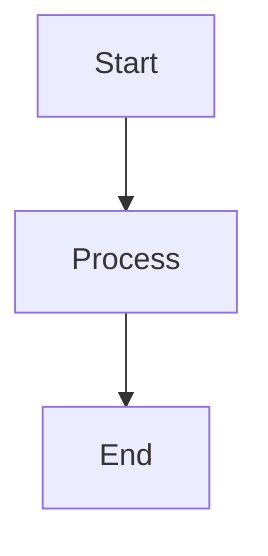

# How to View Mermaid Diagrams

This guide explains how to view the Mermaid diagrams included in the documentation.

## Quick Methods

### Method 1: VS Code / Cursor Extension (Recommended)

1. **Install Extension**:
   - Open VS Code/Cursor
   - Go to Extensions (Ctrl+Shift+X / Cmd+Shift+X)
   - Search for "Markdown Preview Mermaid Support"
   - Install the extension

2. **View Diagrams**:
   - Open any `.md` file with Mermaid diagrams
   - Press `Ctrl+Shift+V` (Windows/Linux) or `Cmd+Shift+V` (Mac)
   - Diagrams will render in the preview pane

### Method 2: GitHub (Easiest)

1. Push your documentation to GitHub
2. View the `.md` files directly on GitHub
3. Mermaid diagrams render automatically

### Method 3: Online Mermaid Editor

1. Go to [mermaid.live](https://mermaid.live)
2. Copy the Mermaid code from the documentation (the content inside ` ```mermaid ` blocks)
3. Paste into the editor
4. View the rendered diagram

**Example**: Copy this code:


### Method 4: Markdown Viewer Extensions

**Chrome/Edge Extensions**:
- "Markdown Viewer" with Mermaid support
- "Markdown Preview Plus"

**Other Tools**:
- **Obsidian**: Native Mermaid support
- **Notion**: Supports Mermaid diagrams
- **Typora**: Paid markdown editor with Mermaid support

## Alternative: Text-Based Diagrams

All documentation files include text-based alternatives below each Mermaid diagram. These can be viewed in any text editor.

## Troubleshooting

### Diagrams Not Showing in VS Code

1. Make sure you have the extension installed
2. Use the preview pane (Ctrl+Shift+V), not the regular editor view
3. Try reloading the window: `Ctrl+R` or `Cmd+R`

### Diagrams Not Rendering on GitHub

1. Ensure the syntax is correct (check for typos)
2. Make sure the code block uses ` ```mermaid ` (not just ` ``` `)
3. Check GitHub's status - sometimes rendering can be delayed

### Need to Export Diagrams

1. Use [mermaid.live](https://mermaid.live) to export as PNG/SVG
2. Or use the Mermaid CLI: `npm install -g @mermaid-js/mermaid-cli`

## Recommended Setup

For the best experience:
1. Install "Markdown Preview Mermaid Support" in VS Code/Cursor
2. Use the preview pane to view documentation
3. Keep GitHub as backup for viewing rendered diagrams

## Quick Reference

- **VS Code Preview**: `Ctrl+Shift+V` / `Cmd+Shift+V`
- **Online Editor**: [mermaid.live](https://mermaid.live)
- **GitHub**: Automatic rendering
- **Text Alternative**: Always available below each diagram
