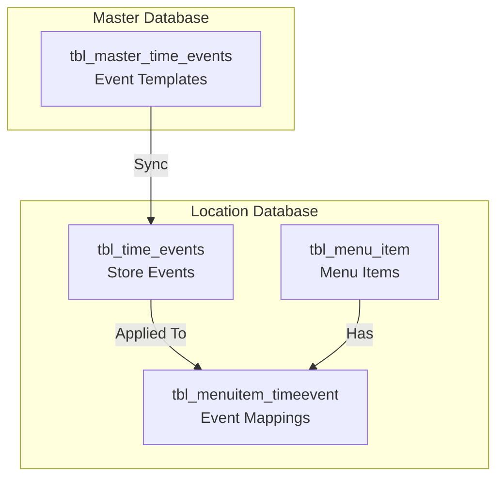
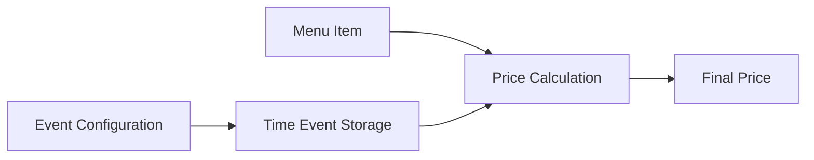
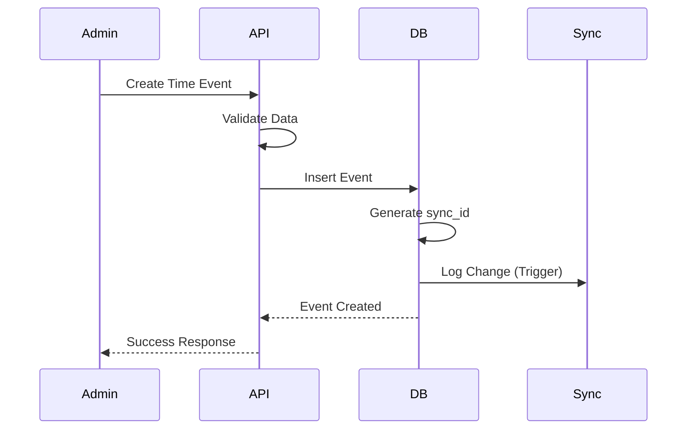
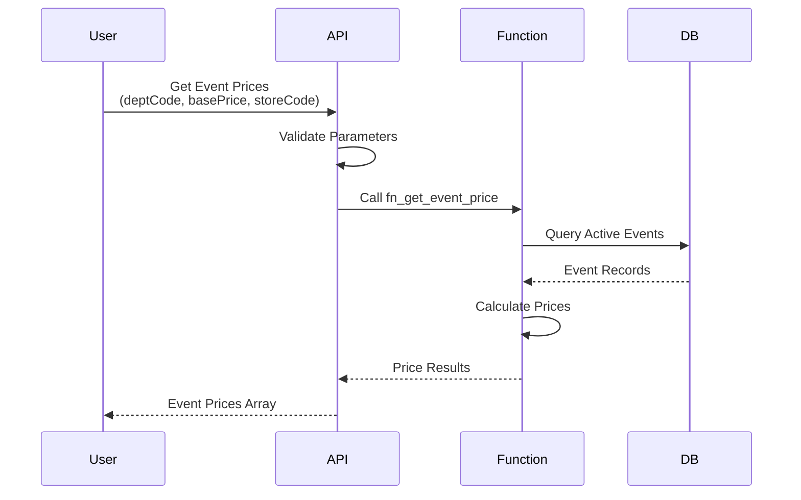
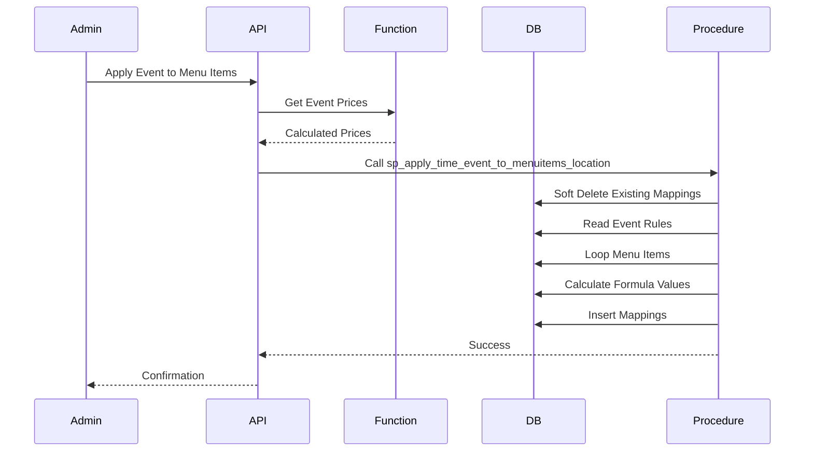

# Event Pricing System

## Table of Contents

1. [Overview](#overview)
2. [System Architecture](#system-architecture)
3. [Function Specification](#function-specification)
4. [Pricing Calculation Logic](#pricing-calculation-logic)
5. [Process Flows](#process-flows)
6. [API Integration](#api-integration)
7. [Usage Examples](#usage-examples)
8. [Multi-Tenant Considerations](#multi-tenant-considerations)

## Overview

The Event Pricing System allows restaurants to apply time-based pricing adjustments to menu items. Events can be configured with specific days, times, departments, and pricing rules.

### Key Features

- **Time-Based Pricing**: Apply pricing rules based on day of week and time ranges
- **Department-Based Filtering**: Target specific departments or all departments
- **Multiple Pricing Modes**: Fixed value or percentage/amount adjustments
- **Store-Specific Events**: Events can be configured per store
- **Override Capability**: Events can override all other events

### Use Cases

- Happy Hour discounts
- Lunch specials
- Weekend pricing
- Holiday promotions
- Department-specific events

## System Architecture

### Database Structure



### Component Flow



## Function Specification

### fn_get_event_price

**Location Database Function**

Calculates event-based pricing for menu items based on department code and base price.

**Function Signature**:
```sql
CREATE OR REPLACE FUNCTION public.fn_get_event_price(
    p_dept_code text,
    p_base_price numeric,
    p_store_code text DEFAULT NULL
)
RETURNS TABLE(event_name text, final_price numeric)
LANGUAGE 'plpgsql'
COST 100
VOLATILE PARALLEL UNSAFE
ROWS 1000
```

**Parameters**:

| Parameter | Type | Description |
|-----------|------|-------------|
| `p_dept_code` | text | Department code to filter events |
| `p_base_price` | numeric | Base price to calculate from |
| `p_store_code` | text | Store code (optional, filters by store) |

**Returns**:

| Column | Type | Description |
|--------|------|-------------|
| `event_name` | text | Name of the time event |
| `final_price` | numeric | Calculated final price (rounded to 2 decimals) |

**Filtering Logic**:

1. **Active Events Only**: `is_active = 1`
2. **Non-Deleted Events**: `is_delete = FALSE`
3. **Store Filtering**: If `p_store_code` provided, filters by `store_code`
4. **Department Matching**: 
   - Events with `override_all_events = TRUE` are included
   - Events where `dept_code` JSONB array contains `p_dept_code`

**Example Call**:
```sql
SELECT * FROM fn_get_event_price('DEPT001', 10.00, 'STORE001');
```

**Example Result**:
```
event_name          | final_price
--------------------|------------
Happy Hour          | 8.00
Lunch Special       | 9.50
```

## Pricing Calculation Logic

### Fixed Value Mode

When `by_fixed_value = TRUE`:

```
final_price = base_price + amount_add - amount_disc
```

**Example**:
- Base Price: $10.00
- Amount Add: $2.00
- Amount Disc: $0.00
- **Final Price**: $12.00

### Percentage/Amount Mixed Mode

When `by_fixed_value = FALSE`:

The system uses a priority-based approach:

**Additions** (applied first):
1. If `GlobalPrice_Amount_Add > 0`: Use amount add
2. Else if `GlobalPrice_Per_Add > 0`: Use percentage add
3. Else: No addition

**Discounts** (applied second):
1. If `GlobalPrice_Amount_Disc > 0`: Use amount discount
2. Else if `GlobalPrice_Per_Disc > 0`: Use percentage discount
3. Else: No discount

**Formula**:
```
final_price = base_price 
            + (amount_add OR base_price * percentage_add / 100)
            - (amount_disc OR base_price * percentage_disc / 100)
```

**Examples**:

**Example 1: Amount Add**
- Base Price: $10.00
- Amount Add: $2.00
- **Final Price**: $12.00

**Example 2: Percentage Add**
- Base Price: $10.00
- Percentage Add: 10%
- **Final Price**: $11.00

**Example 3: Amount Discount**
- Base Price: $10.00
- Amount Disc: $1.50
- **Final Price**: $8.50

**Example 4: Percentage Discount**
- Base Price: $10.00
- Percentage Disc: 15%
- **Final Price**: $8.50

**Example 5: Mixed (Add then Discount)**
- Base Price: $10.00
- Amount Add: $2.00
- Percentage Disc: 10%
- Calculation: ($10.00 + $2.00) - ($12.00 * 10%) = $12.00 - $1.20
- **Final Price**: $10.80

### Rounding

All prices are rounded to **2 decimal places** using PostgreSQL's `ROUND()` function.

## Process Flows

### Event Creation Flow



### Price Calculation Flow



### Menu Item Event Application Flow



## API Integration

### Get Event Prices

**Endpoint**: `GET /api/dashboard/menu-items/time-events`

**Query Parameters**:
- `deptCode` (required): Department code
- `basePrice` (required): Base price as number
- `storeCode` (optional): Store code (uses user's default if not provided)

**Request Example**:
```http
GET /api/dashboard/menu-items/time-events?deptCode=DEPT001&basePrice=10.00&storeCode=STORE001
```

**Response Example**:
```json
[
  {
    "event_name": "Happy Hour",
    "final_price": 8.00
  },
  {
    "event_name": "Lunch Special",
    "final_price": 9.50
  }
]
```

### Master Dashboard API

**Endpoint**: `GET /api/master/menu-items/time-events`

**Query Parameters**:
- `deptCode` (required): Department code
- `basePrice` (required): Base price as number

**Note**: Master API doesn't use `storeCode` parameter (master events are templates).

### Apply Events to Menu Items

**Endpoint**: `POST /api/dashboard/menu-items/[id]/time-events/bulk`

**Query Parameters**:
- `storeCode` (optional): Store code

**Request Body**:
```json
{
  "menuItemCode": "ITEM001",
  "timeEvents": [
    {
      "eventCode": "EVENT001",
      "formulaValue": 15.99,
      "isOverride": false
    },
    {
      "eventCode": "EVENT002",
      "formulaValue": 12.50,
      "isOverride": true
    }
  ]
}
```

**Response**:
```json
{
  "success": true,
  "message": "Time events applied successfully",
  "recordsCreated": 2
}
```

## Usage Examples

### Example 1: Happy Hour Event

**Event Configuration**:
```json
{
  "eventCode": "HH001",
  "eventName": "Happy Hour",
  "deptCode": ["DEPT001", "DEPT002"],
  "globalPriceAmountDisc": 2.00,
  "monday": "Monday",
  "monStartTime": "17:00",
  "monEndTime": "19:00",
  "tuesday": "Tuesday",
  "tueStartTime": "17:00",
  "tueEndTime": "19:00",
  "byFixedValue": false,
  "overrideAllEvents": false,
  "isActive": 1
}
```

**Price Calculation**:
- Base Price: $10.00
- Department: DEPT001
- Time: Monday 18:00
- **Result**: $8.00 (10.00 - 2.00)

### Example 2: Weekend Premium

**Event Configuration**:
```json
{
  "eventCode": "WK001",
  "eventName": "Weekend Premium",
  "deptCode": ["DEPT001"],
  "globalPricePerAdd": 10,
  "saturday": "Saturday",
  "sunday": "Sunday",
  "byFixedValue": false,
  "overrideAllEvents": false,
  "isActive": 1
}
```

**Price Calculation**:
- Base Price: $20.00
- Department: DEPT001
- Day: Saturday
- **Result**: $22.00 (20.00 + 10%)

### Example 3: Override All Events

**Event Configuration**:
```json
{
  "eventCode": "OV001",
  "eventName": "Special Promotion",
  "overrideAllEvents": true,
  "globalPriceAmountDisc": 5.00,
  "byFixedValue": false,
  "isActive": 1
}
```

**Price Calculation**:
- Base Price: $15.00
- Department: Any
- **Result**: $10.00 (15.00 - 5.00)
- **Note**: This event applies regardless of department code

### Example 4: Fixed Value Event

**Event Configuration**:
```json
{
  "eventCode": "FV001",
  "eventName": "Fixed Price Special",
  "deptCode": ["DEPT001"],
  "byFixedValue": true,
  "globalPriceAmountAdd": 0,
  "globalPriceAmountDisc": 0,
  "isActive": 1
}
```

**Price Calculation**:
- Base Price: $12.00
- **Result**: $12.00 (base_price + 0 - 0)
- **Note**: Fixed value mode ignores base price adjustments

## Multi-Tenant Considerations

### Master vs Location Databases

**Master Database**:
- Stores event templates (`tbl_master_time_events`)
- No `storeCode` column
- Function: `fn_get_event_price(p_dept_code, p_base_price)` (2 parameters)
- Used by master dashboard for template management

**Location Database**:
- Stores store-specific events (`tbl_time_events`)
- Includes `storeCode` column
- Function: `fn_get_event_price(p_dept_code, p_base_price, p_store_code)` (3 parameters)
- Used by location dashboard and POS clients

### Store Code Filtering

When `p_store_code` is provided:
- Only events matching the store code are returned
- Ensures data isolation between stores

When `p_store_code` is NULL:
- Returns events for all stores (use with caution)
- Useful for admin views or testing

### Sync Considerations

1. **Master to Location Sync**: Master events sync to location database with `storeCode` set
2. **Store-Specific Events**: Location events can be created directly in location database
3. **Event Application**: Stored procedure `sp_apply_time_event_to_menuitems_location` requires `storeCode`

## Related Documentation

- [Database Schema](./DATABASE_SCHEMA.md) - Database structure details
- [Functions Reference](./FUNCTIONS_REFERENCE.md) - Function documentation
- [API Reference](./API_REFERENCE.md) - API endpoint details
- [Sync System](./SYNC_SYSTEM_COMPLETE.md) - Sync system details
