# Sync System Comprehensive Documentation

## Table of Contents

1. [Overview](#overview)
2. [System Architecture](#system-architecture)
3. [Sync Tables and Dependencies](#sync-tables-and-dependencies)
4. [Sync Implementation Details](#sync-implementation-details)
5. [Sync Service Architecture](#sync-service-architecture)
6. [Sync Flow Diagrams](#sync-flow-diagrams)
7. [API Endpoints](#api-endpoints)
8. [Error Handling and Retry Logic](#error-handling-and-retry-logic)
9. [Code Generation and Triggers](#code-generation-and-triggers)
10. [Best Practices](#best-practices)

---

## Overview

The Sync System is a comprehensive data synchronization solution that enables bidirectional and unidirectional data flow between:

- **Master Database**: Central repository containing master data templates
- **Location Databases**: Individual location-specific databases for each restaurant/store

### Key Features

- **Incremental Sync**: Syncs only changed records via `sync_log` table
- **Full Sync**: Re-syncs all records from master tables
- **Dependency Management**: Automatically handles table dependencies and sync order
- **Error Handling**: Robust retry mechanism with exponential backoff
- **Progress Tracking**: Real-time sync progress and status monitoring
- **Location-to-Location Sync**: Clone/merge data between locations

### Sync Types

1. **Master → Location Sync**: Primary sync from master templates to locations
2. **Location → Location Sync**: Clone or merge data between locations
3. **Incremental Sync**: Process only pending changes
4. **Full Sync**: Re-sync all records regardless of sync status

---

## System Architecture

### High-Level Architecture

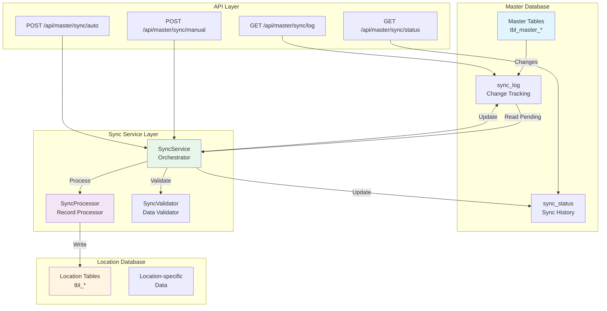

### Database Architecture

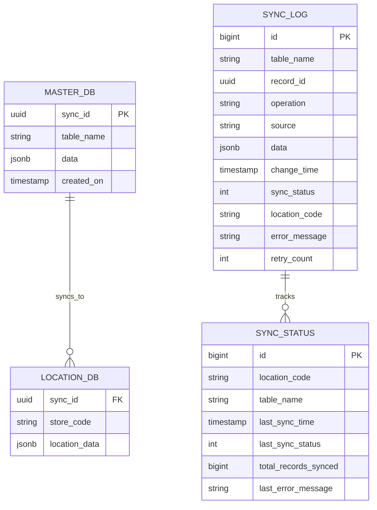

---

## Sync Tables and Dependencies

### Complete Table List

The sync system handles **24 syncable tables** organized into categories:

#### 1. Independent Tables (No Dependencies)
- `tbl_master_tax` → `tbl_tax`
- `tbl_master_printer` → `tbl_printer`
- `tbl_master_station` → `tbl_station`
- `tbl_master_department_type` → `tbl_department_type`
- `tbl_master_department` → `tbl_department`
- `tbl_master_time_events` → `tbl_time_events`
- `tbl_master_prep_zone` → `tbl_prep_zone`
- `tbl_master_discount_master` → `tbl_discount_master`
- `tbl_master_suggestion` → `tbl_suggestion`

#### 2. Permission System Tables
- `tbl_permission` → `permissions`
- `tbl_role` → `roles`
- `tbl_role_permission` → `role_permissions` (depends on `tbl_permission` and `tbl_role`)

#### 3. Menu Hierarchy Tables
- `tbl_master_menu_master` → `tbl_menu_master` (parent)
- `tbl_master_menu_category` → `tbl_menu_category` (depends on `menu_master`)
- `tbl_master_menu_item` → `tbl_menu_item` (depends on `menu_master` and `menu_category`)

#### 4. Modifier Hierarchy Tables
- `tbl_master_modifier_group` → `tbl_modifier_group` (parent)
- `tbl_master_modifier_item` → `tbl_modifier_item` (depends on `modifier_group`)

#### 5. Relationship/Junction Tables
- `tbl_master_menu_master_event` → `tbl_menu_master_event` (depends on `menu_master` and `time_events`)
- `tbl_master_menu_category_modifier` → `tbl_menu_category_modifier` (depends on `menu_category` and `modifier_group`)
- `tbl_master_menu_item_modifier_group` → `tbl_menu_item_modifier_group` (depends on `menu_item` and `modifier_group`)
- `tbl_master_menuitem_timeevent` → `tbl_menuitem_timeevent` (depends on `menu_item` and `time_events`)

#### 6. User Management Tables (Individual Sync Only)
- `tbl_user` → `users` (synced individually on create/update, not in full sync)

### Table Dependency Graph

```mermaid
graph TD
    %% Independent Tables
    TAX[tbl_master_tax]
    PRINTER[tbl_master_printer]
    STATION[tbl_master_station]
    DEPT_TYPE[tbl_master_department_type]
    TIME_EVENTS[tbl_master_time_events]
    DISCOUNT[tbl_master_discount_master]
    SUGGESTION[tbl_master_suggestion]
    
    %% Permission System
    PERMISSION[tbl_permission]
    ROLE[tbl_role]
    ROLE_PERM[tbl_role_permission]
    
    %% Menu Hierarchy
    MENU_MASTER[tbl_master_menu_master]
    MENU_CAT[tbl_master_menu_category]
    MENU_ITEM[tbl_master_menu_item]
    
    %% Modifier Hierarchy
    MOD_GROUP[tbl_master_modifier_group]
    MOD_ITEM[tbl_master_modifier_item]
    
    %% Department
    DEPARTMENT[tbl_master_department]
    PREP_ZONE[tbl_master_prep_zone]
    
    %% Junction Tables
    MENU_MASTER_EVENT[tbl_master_menu_master_event]
    MENU_CAT_MOD[tbl_master_menu_category_modifier]
    MENU_ITEM_MOD[tbl_master_menu_item_modifier_group]
    MENU_ITEM_TIME[tbl_master_menuitem_timeevent]
    
    %% Dependencies
    DEPT_TYPE --> DEPARTMENT
    TAX --> DEPARTMENT
    STATION --> PREP_ZONE
    PRINTER --> PREP_ZONE
    
    PERMISSION --> ROLE_PERM
    ROLE --> ROLE_PERM
    
    MENU_MASTER --> MENU_CAT
    MENU_MASTER --> MENU_MASTER_EVENT
    MENU_CAT --> MENU_ITEM
    MENU_CAT --> MENU_CAT_MOD
    MENU_ITEM --> MENU_ITEM_MOD
    MENU_ITEM --> MENU_ITEM_TIME
    
    MOD_GROUP --> MOD_ITEM
    MOD_GROUP --> MENU_CAT_MOD
    MOD_GROUP --> MENU_ITEM_MOD
    
    TIME_EVENTS --> MENU_MASTER_EVENT
    TIME_EVENTS --> MENU_ITEM_TIME
    
    style TAX fill:#e1f5ff
    style PRINTER fill:#e1f5ff
    style STATION fill:#e1f5ff
    style MENU_MASTER fill:#fff4e1
    style MOD_GROUP fill:#e8f5e9
    style MENU_ITEM_TIME fill:#f3e5f5
```

### Sync Order

Tables are synced in the following order to satisfy foreign key constraints:

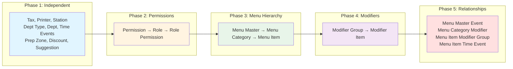

---

## Sync Implementation Details

### 1. Sync Log Table Structure

The `sync_log` table tracks all changes in master tables:

```sql
CREATE TABLE sync_log (
    id BIGSERIAL PRIMARY KEY,
    table_name VARCHAR(255) NOT NULL,
    record_id UUID NOT NULL,           -- References sync_id in master table
    operation VARCHAR(20) NOT NULL,    -- INSERT, UPDATE, DELETE
    source VARCHAR(50) NOT NULL,       -- server, terminal, website, location
    data JSONB,                         -- Full record data (for INSERT/UPDATE)
    change_time TIMESTAMP NOT NULL,
    sync_status INTEGER DEFAULT 0,     -- 0=pending, 1=processed, 2=failed
    location_code VARCHAR(50),         -- NULL = all locations, specific = one location
    error_message TEXT,
    retry_count INTEGER DEFAULT 0,
    last_retry_at TIMESTAMP,
    synced_at TIMESTAMP,
    synced_by INTEGER
);
```

### 2. Sync Status Table Structure

The `sync_status` table tracks sync history per location/table:

```sql
CREATE TABLE sync_status (
    id BIGSERIAL PRIMARY KEY,
    location_code VARCHAR(50) NOT NULL,
    table_name VARCHAR(255) NOT NULL,
    last_sync_time TIMESTAMP,
    last_sync_status INTEGER,          -- 0=success, 1=failed
    total_records_synced BIGINT DEFAULT 0,
    last_error_message TEXT,
    created_at TIMESTAMP DEFAULT NOW(),
    updated_at TIMESTAMP DEFAULT NOW(),
    UNIQUE(location_code, table_name)
);
```

### 3. Change Tracking Mechanism

Changes are tracked via database triggers on master tables:

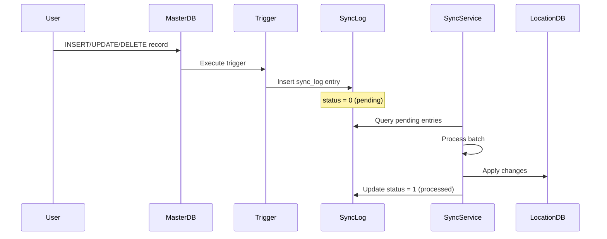

### 4. Sync ID System

Every syncable record has a `sync_id` (UUID) that uniquely identifies it across databases:

- **Master Database**: `sync_id` is the primary identifier
- **Location Database**: `sync_id` is used to find existing records
- **Matching Logic**: Records are matched by `sync_id`, not by business codes

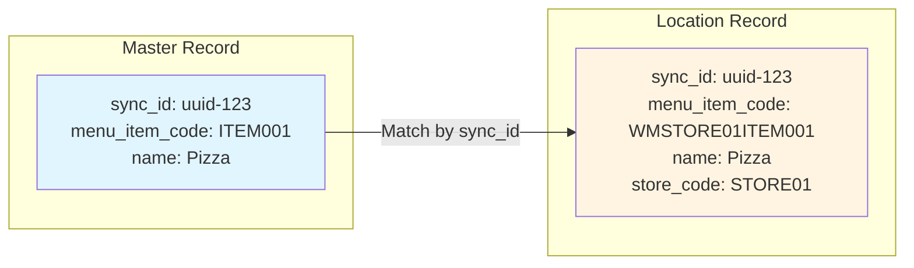

---

## Sync Service Architecture

### Service Components

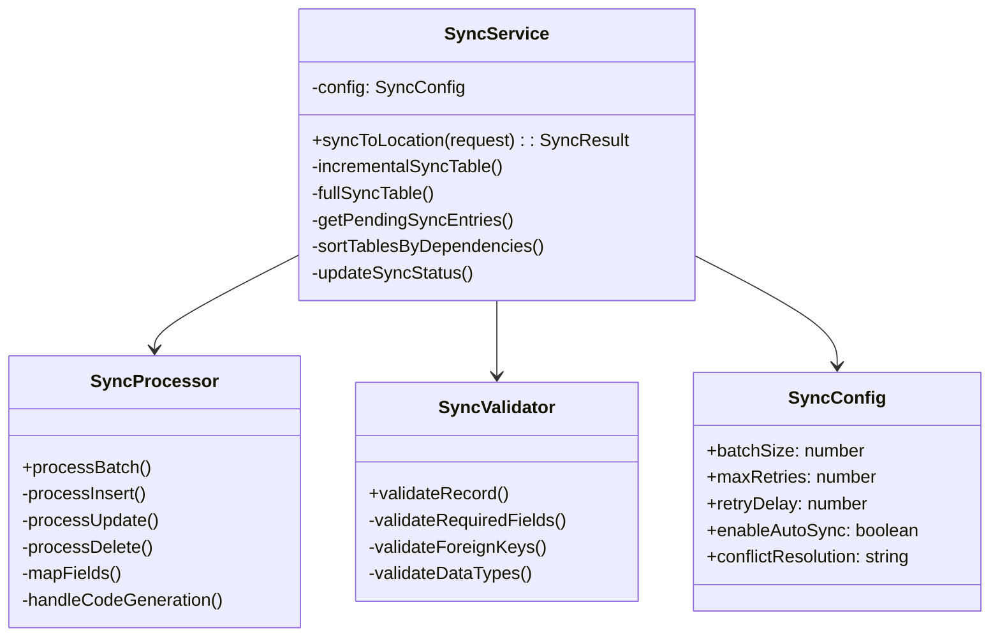

### SyncService Flow

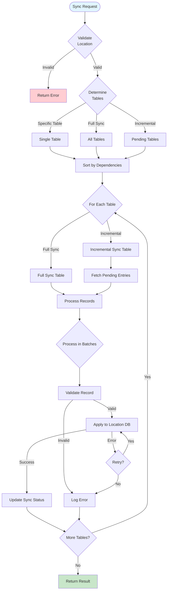

### Incremental Sync Process

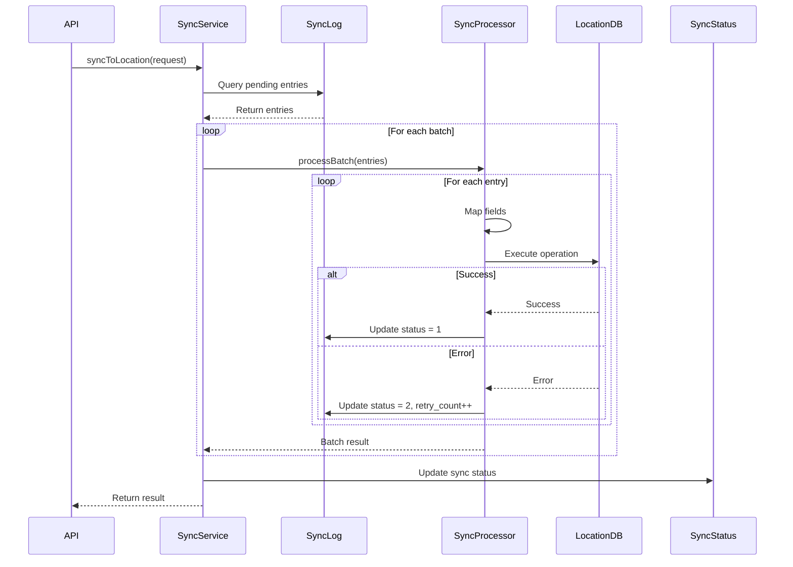

### Full Sync Process

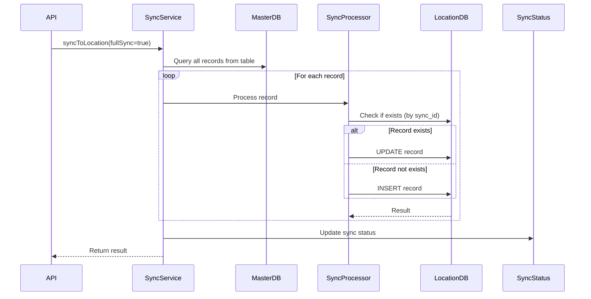

---

## Sync Flow Diagrams

### Complete Sync Flow

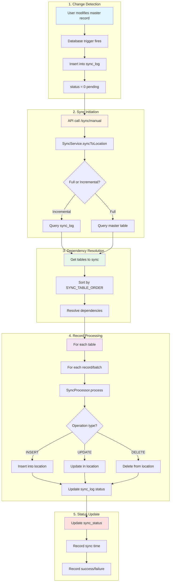

### Menu Item Time Event Special Sync Flow

The `tbl_master_menuitem_timeevent` table has special handling:

```mermaid
flowchart TD
    Start([Sync Menu Item Time Event]) --> Check[Check table exists]
    Check -->|Not exists| Return[Return 0 records]
    Check -->|Exists| Query[Query master table]
    
    Query --> Filter[Filter: isDelete=false, isActive=true]
    Filter --> Loop[For each record]
    
    Loop --> Validate{Validate<br/>Required Fields}
    Validate -->|Invalid| Skip[Skip record]
    Validate -->|Valid| FindMenu[Find location menu item<br/>by sync_id]
    
    FindMenu -->|Found| UseMenu[Use location code]
    FindMenu -->|Not found| GenMenu[Generate WM{storeCode}{code}]
    
    UseMenu --> FindTime[Find location time event<br/>by sync_id]
    GenMenu --> FindTime
    
    FindTime -->|Found| UseTime[Use location code]
    FindTime -->|Not found| GenTime[Generate WM{storeCode}{code}]
    
    UseTime --> CheckExists[Check if record exists<br/>by sync_id + store_code]
    GenTime --> CheckExists
    
    CheckExists -->|Exists| Skip2[Skip - already synced]
    CheckExists -->|Not exists| GenCode[Generate code<br/>WM{storeCode}MT{sequence}]
    
    GenCode --> Insert[Insert into location DB]
    Insert --> Success[Success]
    
    Skip --> Next[Next record]
    Skip2 --> Next
    Success --> Next
    Next -->|More| Loop
    Next -->|Done| Complete[Return count]
    
    style Start fill:#e1f5ff
    style Complete fill:#c8e6c9
    style Skip fill:#ffcdd2
    style Skip2 fill:#ffcdd2
```

---

## API Endpoints

### 1. Manual Sync Endpoint

**POST** `/api/master/sync/manual`

Triggers manual synchronization from Master to Location database.

**Request Body:**
```json
{
  "locationCode": "STORE01",
  "tableName": "tbl_master_menu_item",  // Optional: specific table or omit for all
  "fullSync": false,                     // Optional: true for full sync
  "forceSync": false                      // Optional: force sync even if already synced
}
```

**Response:**
```json
{
  "success": true,
  "message": "Sync completed successfully for location STORE01",
  "data": {
    "locationCode": "STORE01",
    "tableName": "tbl_master_menu_item",
    "recordsProcessed": 150,
    "recordsSucceeded": 148,
    "recordsFailed": 2,
    "duration": 5234,
    "errors": [
      {
        "recordId": "uuid-123",
        "operation": "INSERT",
        "error": "Foreign key constraint violation",
        "tableName": "tbl_master_menu_item"
      }
    ],
    "dependentTables": [
      {
        "tableName": "tbl_master_menu_item_modifier_group",
        "recordsProcessed": 45,
        "recordsSucceeded": 45,
        "recordsFailed": 0
      }
    ]
  }
}
```

### 2. Sync Status Endpoint

**GET** `/api/master/sync/status`

Retrieves sync status for locations and tables.

**Query Parameters:**
- `locationCode` (optional): Filter by location
- `tableName` (optional): Filter by table

**Response:**
```json
{
  "success": true,
  "data": {
    "status": [
      {
        "locationCode": "STORE01",
        "tableName": "tbl_master_menu_item",
        "lastSyncTime": "2026-01-27T10:30:00Z",
        "lastSyncStatus": 0,
        "totalRecordsSynced": 150,
        "lastErrorMessage": null
      }
    ],
    "pendingCount": 5
  }
}
```

### 3. Sync Log Endpoint

**GET** `/api/master/sync/log`

Retrieves sync log entries (pending, processed, or failed).

**Query Parameters:**
- `locationCode` (optional): Filter by location
- `tableName` (optional): Filter by table
- `status` (optional): 0=pending, 1=processed, 2=failed
- `limit` (optional): Number of entries to return

**Response:**
```json
{
  "success": true,
  "data": {
    "entries": [
      {
        "id": "123",
        "tableName": "tbl_master_menu_item",
        "recordId": "uuid-123",
        "operation": "INSERT",
        "source": "server",
        "changeTime": "2026-01-27T10:00:00Z",
        "syncStatus": 0,
        "locationCode": null,
        "errorMessage": null,
        "retryCount": 0
      }
    ],
    "total": 50
  }
}
```

### 4. Auto Sync Endpoint

**POST** `/api/master/sync/auto`

Triggers automatic sync for all locations (used by scheduled jobs).

**Request Body:**
```json
{
  "locationCode": "STORE01",  // Optional: specific location or omit for all
  "fullSync": false
}
```

---

## Error Handling and Retry Logic

### Error Types

1. **Validation Errors**: Invalid data format, missing required fields
2. **Foreign Key Errors**: Referenced records don't exist
3. **Constraint Violations**: Unique constraints, check constraints
4. **Database Errors**: Connection issues, timeouts
5. **Code Generation Errors**: Failed to generate unique codes

### Retry Mechanism

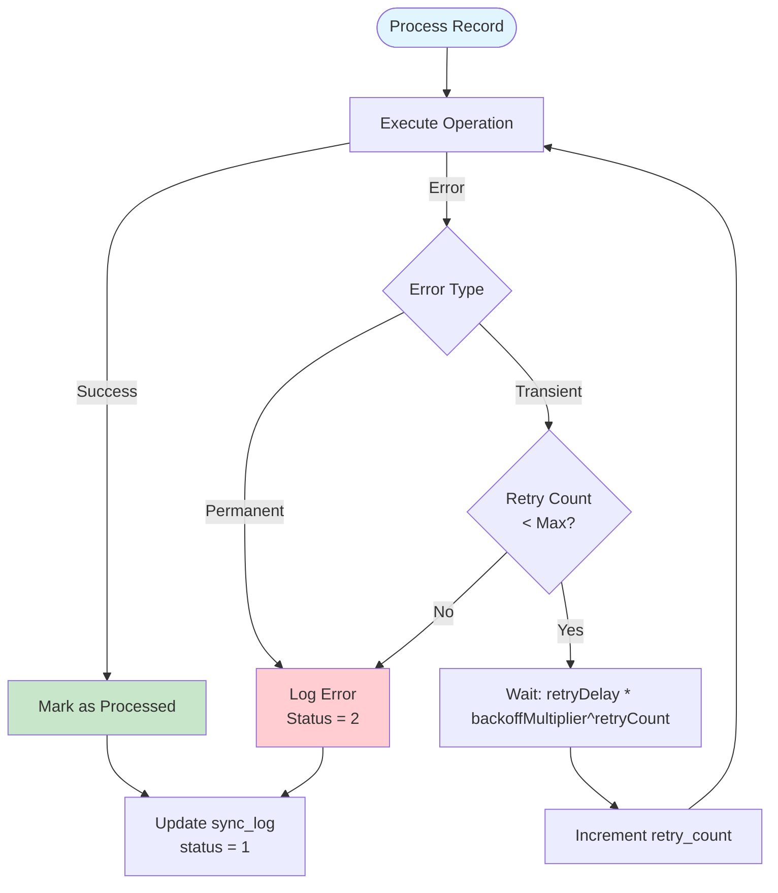

### Retry Configuration

```typescript
{
  maxRetries: 3,
  retryDelay: 1000,        // Initial delay: 1 second
  maxRetryDelay: 60000,    // Maximum delay: 60 seconds
  backoffMultiplier: 2     // Exponential backoff
}
```

**Retry Schedule:**
- Attempt 1: Immediate
- Attempt 2: Wait 1 second
- Attempt 3: Wait 2 seconds
- Attempt 4: Wait 4 seconds
- Maximum: 60 seconds

---

## Code Generation and Triggers

### Code Generation Rules

Location-specific codes are generated using patterns:

1. **Menu Item Time Event**: `WM{storeCode}MT{sequence}`
   - Example: `WMSTORE01MT1`, `WMSTORE01MT2`

2. **Menu Items**: `WM{storeCode}{originalCode}`
   - Example: Master `ITEM001` → Location `WMSTORE01ITEM001`

3. **Time Events**: `WM{storeCode}{originalCode}`
   - Example: Master `EVENT001` → Location `WMSTORE01EVENT001`

### Code Generation Flow

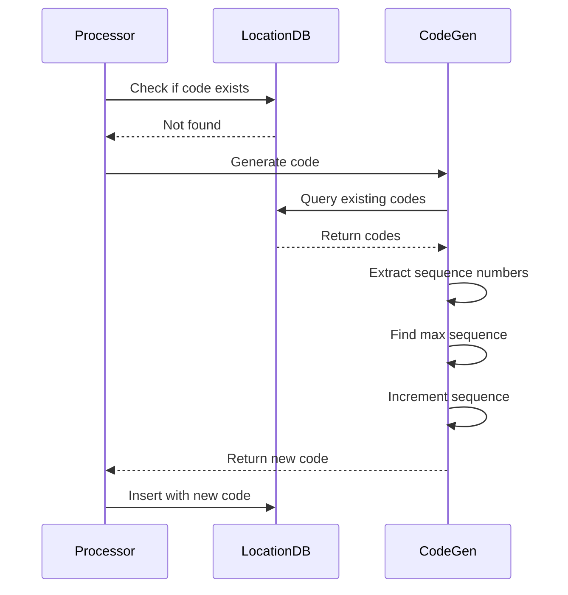

### Database Triggers

Triggers on master tables automatically create `sync_log` entries:

```sql
CREATE OR REPLACE FUNCTION sync_log_trigger()
RETURNS TRIGGER AS $$
BEGIN
    INSERT INTO sync_log (
        table_name,
        record_id,
        operation,
        source,
        data,
        change_time
    ) VALUES (
        TG_TABLE_NAME,
        COALESCE(NEW.sync_id, OLD.sync_id),
        TG_OP,
        'server',
        CASE
            WHEN TG_OP = 'DELETE' THEN row_to_json(OLD)
            ELSE row_to_json(NEW)
        END,
        NOW()
    );
    RETURN NEW;
END;
$$ LANGUAGE plpgsql;
```

---

## Best Practices

### 1. Sync Order

Always sync tables in dependency order:
- Independent tables first
- Parent tables before child tables
- Junction tables last

### 2. Batch Processing

Process records in batches (default: 100 records) to:
- Reduce memory usage
- Improve performance
- Enable progress tracking

### 3. Error Handling

- Log all errors with context
- Retry transient errors
- Skip records with permanent errors
- Continue processing remaining records

### 4. Monitoring

- Monitor `sync_status` table for sync health
- Check `sync_log` for pending entries
- Set up alerts for failed syncs
- Track sync duration and performance

### 5. Data Integrity

- Always validate records before syncing
- Check foreign key constraints
- Handle code generation conflicts
- Preserve `sync_id` for record matching

### 6. Performance Optimization

- Use indexes on `sync_id` columns
- Index `sync_log` table on `sync_status` and `location_code`
- Use connection pooling
- Process in parallel where possible (with caution)

---

## Appendix: Table Field Mappings

### Key Field Mappings

| Master Table | Location Table | Key Fields |
|-------------|---------------|------------|
| `tbl_master_menu_item` | `tbl_menu_item` | `menu_item_code`, `menu_master_code`, `menu_category_code`, `dept_code` |
| `tbl_master_menu_master` | `tbl_menu_master` | `menu_master_code`, `name`, `is_event_menu` |
| `tbl_master_time_events` | `tbl_time_events` | `Event_code`, `EventName`, `dept_code` |
| `tbl_master_menuitem_timeevent` | `tbl_menuitem_timeevent` | `menu_item_code`, `time_event_code`, `formula_value` |

### Sync Metadata Fields

All synced records include:
- `sync_id`: UUID for cross-database matching
- `sync_source`: Origin of sync (server, terminal, website, location)
- `store_code`: Location-specific identifier
- `isSyncToWeb`: Web sync flag
- `isSyncToLocal`: Local sync flag

---

## Conclusion

This documentation provides a comprehensive overview of the sync system architecture, implementation, and best practices. For specific implementation details, refer to the source code in:

- `src/lib/sync/syncService.ts` - Main sync orchestrator
- `src/lib/sync/syncProcessor.ts` - Record processor
- `src/lib/sync/types.ts` - Type definitions and configurations
- `src/services/syncService.ts` - Legacy sync functions
- `src/app/api/master/sync/manual/route.ts` - API endpoint

For UI documentation, see `docs/SYNC_UI_GUIDE.md`.
